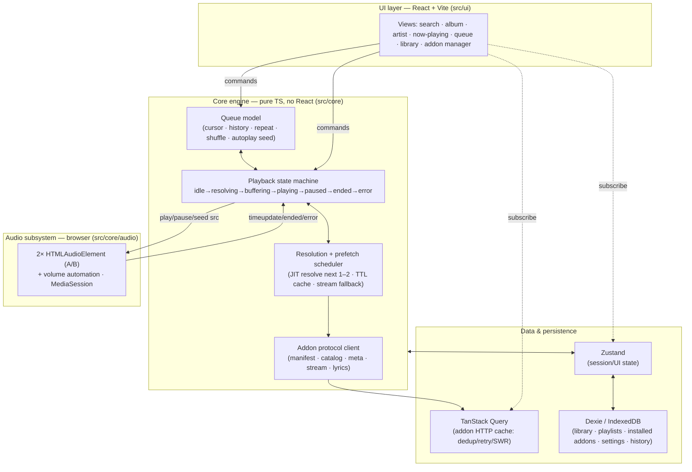

# Player Architecture (web-only v1)

This is the architecture plan for the `player` repo. It is **deliberately
not a port of stremio-web / stremio-core.** It takes Stremio's *principles*
where they apply and makes independent, web-native choices everywhere the
reasoning behind Stremio's own choices doesn't transfer to a web-only music
player.

> Relationship to the master plan: this document **supersedes** the
> player-specific rows of
> [`IMPLEMENTATION_PLAN.md`](https://github.com/p2p-songs/.github/blob/main/docs/IMPLEMENTATION_PLAN.md)
> §5/§7 (the "Core state pattern = Elm", "music-core", "Storage = idb"
> rows). The rest of the master plan — protocol, addons, `stream-debrid`,
> legal invariants — is unchanged and still authoritative.

---

## 1. What we keep from Stremio, and what we drop

Stremio-core is an Elm-style state machine (`Msg → Effects → Model`) written
in **Rust, compiled to WASM/JNI/native**. It's a beautiful design — *for the
problem Stremio has*, which is: **run one identical core on web, desktop,
Android, iOS, and TV.** The Elm-in-Rust decision is downstream of that
cross-platform constraint. Predictable state was the goal; "one verified
core binary everywhere" was the reason it's Rust and the reason it's a single
monolithic model.

**We said web-only. That constraint is gone, so the decision it forced is
gone with it.** Copying Elm-in-Rust here would be imitating the *answer* to a
question we're not asking.

| Stremio principle | Keep? | Web-only music reasoning |
|---|---|---|
| UI-agnostic, headless-testable engine | **Keep** | Still hugely valuable: the queue/playback/resolution logic must be testable without a browser or a real addon, and swappable under any UI. We enforce this as an internal boundary (§8), not a Rust FFI boundary. |
| Local-first state, no mandatory account | **Keep** | Library, playlists, installed addons, settings all live client-side. Matches Stremio and suits a personal-use tool. |
| Predictable, unidirectional state | **Keep the property, drop the mechanism** | We get this from an explicit state machine *scoped to playback* (§4) + a normal reactive store, not from one hand-rolled global `Msg/Effect` runtime. |
| Addon protocol client (fetch manifest/catalog/meta/stream/lyrics) | **Keep** | This is the whole point of the system. But on web, HTTP caching/dedup/retry/stale-while-revalidate is a *solved problem* (§6) — Stremio hand-rolled it in Rust because Rust had no TanStack Query. |
| Elm `Msg → Effects → Model` as the global architecture | **Drop** | Ceremony without payoff for a single-target TS app. Replaced by layered concerns (§3). |
| Rust / WASM core | **Drop (for v1; reconsider only if a native shell is ever built)** | No cross-platform target = no reason to pay the Rust+WASM+bridge toolchain cost. |
| One monolithic Model | **Drop** | Music state is heterogeneous: fast-changing playback state, cache-like addon responses, and durable library data have *different* lifetimes and want different tools. Forcing them into one model is worse, not better. |

---

## 2. What's actually different about music (the first-principles part)

The architecture is driven by the ways audio streaming is *not* like video
streaming. These differences, not Stremio's code, decide the design.

| Dimension | Video (Stremio) | Music (us) | Architectural consequence |
|---|---|---|---|
| Item length | ~45–120 min | ~3–4 min | You cross a track boundary constantly. Transitions are the hot path. |
| Session shape | Watch **one** thing | Play **dozens** in a row | **The queue is the central object,** not "the current stream." |
| Resolution latency tolerance | Seconds are fine before a movie | Any stall between tracks feels broken | **Stream resolution must be prefetched and hidden** (§5). This is the single most important idea in this doc. |
| Transitions | "Next episode" (coarse) | Gapless / crossfade (sub-second, seamless) | Dedicated audio subsystem with dual elements + volume automation (§4b). |
| Interaction rate | Low (pick, watch) | High (skip, skip, reorder, shuffle) | State changes must be cheap and predictable → explicit playback machine. |
| Library size | Small watchlist | Thousands of tracks/playlists | Persistence layer needs **indexed local queries/search** (§6), not a JSON blob. |
| Foreground? | Full-screen, foreground | Background/ambient, other tabs, screen off | **MediaSession + PWA** are first-class, not polish (§4c, §7). |
| Endless play | Rare | Expected (radio/autoplay) | Queue must be **extendable from a seed source**, not a fixed list (§4a). |
| Link lifetime | Resolve once, watch | Debrid links can **expire**; you resolve ~60 times/hour | Resolve **just-in-time** for the next 1–2 tracks with a TTL cache — never resolve the whole queue upfront (§5). |

If you get exactly one thing right in this repo, it's the row in bold:
**decoupling resolution from playback.** Everything else is comparatively
standard web app engineering.

---

## 3. Layered architecture

Rather than one Elm model, four layers with clear ownership. Data flows up
via subscriptions; commands flow down via method calls / events.



**Why this beats one monolithic model:** the four data concerns have
genuinely different lifetimes. Playback state is ephemeral and changes many
times per minute (state machine). Addon responses are cache-like — fetch,
reuse, expire (TanStack Query). Library data is durable and queried
(Dexie). UI/session state is glue (Zustand). One model would force one
lifetime policy on all four.

---

## 4. The core engine

Lives in `src/core`, **imports nothing from React or the DOM UI** (audio
element access is allowed — it's a platform API, isolated in `core/audio`).
Fully unit-testable headless with a fake audio backend and a fake resolver.

### 4a. Queue model

The queue is the heart of the player. It is an explicit data structure, not
an array in a component.

```ts
type RepeatMode = "off" | "one" | "all";

interface QueueItem {
  id: string;                 // stable queue-item id (not the track id — same track can appear twice)
  track: TrackRef;            // { mbid, title, artist, album, durationMs, artwork }
  resolution: ResolutionState; // idle | resolving | resolved(streams, chosenIdx, url, expiresAt) | failed
}

interface Queue {
  items: QueueItem[];         // the canonical order
  cursor: number;             // index of the current item
  order: number[];            // playback order over items — identity when shuffle off,
                              // a stored permutation when shuffle on (so toggling shuffle
                              // off restores the original order non-destructively)
  repeat: RepeatMode;
  autoplaySeed?: RadioSeed;   // when cursor nears the end, extend from this (similar-artist / addon radio)
}
```

Design rules:
- **Non-destructive shuffle:** never reorder `items`; shuffle is a permutation
  in `order`. Toggling shuffle is reversible and never loses the queue.
- **Same track twice is legal** (hence per-item `id`) — playlists and radio
  routinely repeat tracks.
- **Autoplay/radio** extends the queue when the cursor approaches the end,
  from a seed (a track/artist → "similar" via a catalog addon or ListenBrainz).
  The queue is potentially infinite; the model must never assume it's finite.

### 4b. Playback state machine

Playback is a genuine state machine with tricky async edges (resolve →
buffer → play, user skips mid-resolve, seek, stream failure → fallback).
Modeling it explicitly is where we recapture Stremio's "predictable state"
principle — **scoped to the one place it earns its keep**, not spread across
the whole app.

```
        ┌──────── skip / new selection ────────┐
        ▼                                       │
idle → resolving → buffering → playing ⇄ paused │
        │             │           │             │
        │             │           └── ended ────┤ (advance: repeat/next/radio)
        └── failed ◄───┘  (try next stream in list, else skip-ahead)
```

- Entering `resolving` triggers the scheduler (§5) for the *current* item if
  not already resolved (usually it is, thanks to prefetch).
- `failed` doesn't halt the queue: try the next `stream` in the item's
  resolved list (a stream addon returns several — qualities/sources); if all
  fail, skip-ahead to the next item. A dead link must never freeze playback.
- Seeking is handled by the audio element natively (HTTP `Range`), the
  machine just tracks position for UI/MediaSession/scrobble.

**Recommendation: model this with [XState](https://stately.ai/).** It makes
impossible states impossible, is web-native and TS-first, and is
visualizable/testable — the Elm benefits, none of the Rust cost.
*Lighter alternative:* a hand-rolled discriminated-union reducer (~150 lines,
zero deps). Decision flagged in §9; either is fine, XState preferred for the
async correctness guarantees on the failure/skip edges.

### 4c. Audio subsystem (`src/core/audio`)

**Two `HTMLAudioElement`s (A/B), ping-ponged.** The idle element preloads the
next track's resolved URL (`preload="auto"`); on `ended` (or a crossfade
point) the roles swap. This gives near-gapless and true crossfade via JS
volume automation on the two elements.

Key web-specific reasoning:
- **Crossfade via `element.volume` automation, not Web Audio — on purpose.**
  Routing a cross-origin media element through the Web Audio graph
  (`MediaElementAudioSourceNode`) *taints* it unless the source sends CORS
  headers, and **debrid/CDN links frequently won't.** Volume automation on
  the raw `<audio>` element works regardless of CORS. So the core
  crossfade/gapless path deliberately avoids Web Audio.
- **Web Audio is an optional enhancement,** gated on CORS-enabled sources,
  for visualizer/EQ only — never on the critical playback path. Most streams
  won't qualify, and that's fine.
- **`MediaSession API`** wired here: metadata (title/artist/artwork),
  action handlers (play/pause/next/prev/seek) → OS lock screen, media keys,
  Bluetooth controls, notification. This is a headline feature for a
  background music app, not polish.
- The subsystem exposes a narrow interface (`load(url)`, `play()`,
  `pause()`, `seek(ms)`, `preload(url)`, `crossfadeTo(url)`, events) so the
  machine can be tested against a **fake** implementation with no DOM.

---

## 5. Resolution + prefetch scheduler — the centerpiece

The reason a naive "resolve on play" music player feels broken: every track
boundary incurs the full stream-addon round trip (for `stream-debrid`:
indexer query → debrid cache-check → unrestrict), which can be 1–5 s. Users
skip and expect *instant* sound.

**The scheduler decouples resolution from playback:**

1. **Trigger:** when the current track starts (and again at a "~30 s
   remaining" mark as a safety net), asynchronously resolve the **next 1–2
   queue items** — call the stream addon(s), pick the best stream, get the
   playable URL, store it on the `QueueItem` with an `expiresAt`.
2. **Preload:** hand the resolved next URL to the idle audio element so the
   browser buffers its opening while the current track plays.
3. **On advance:** the next item is already `resolved` + buffered → playback
   starts with no perceptible gap.
4. **TTL / expiry:** debrid links can expire. **Never resolve the whole queue
   upfront.** Resolve JIT for the near horizon only; if a resolved URL is
   past (or near) `expiresAt` when we reach it, re-resolve. This is a hard
   difference from a "resolve once" video player.
5. **Fallback:** a stream addon returns *several* streams per track. The
   scheduler keeps the ranked list; on load failure the machine walks down
   it, then skips-ahead. Resolution failures degrade, never halt.
6. **Cancellation:** if the user reorders/skips, in-flight resolutions for
   items no longer near the cursor are cancelled (AbortController) to avoid
   wasting debrid API calls and hitting rate limits.

This component is pure logic over the addon client + queue, so it's
**fully unit-testable** with a fake resolver that simulates latency,
expiry, and failure.

---

## 6. Data & persistence

| Concern | Tool | Why (web-native reasoning) |
|---|---|---|
| Addon HTTP responses (catalog, meta, search, stream, lyrics) | **TanStack Query** | Caching, request dedup, retries, stale-while-revalidate, parallel fan-out across installed addons, cancellation — all the machinery stremio-core hand-writes in Rust, already solved and battle-tested on web. Merge/dedup addon results by MBID on top. |
| Durable library: saved tracks/albums/artists, playlists, play history | **Dexie (IndexedDB)** | A music library grows to thousands of items and needs **indexed local search/filter/sort** — that wants a queryable store, not a JSON blob. (`idb` is the lighter fallback if v1 library stays small; Dexie recommended because local library search is a core music-app expectation.) |
| Installed addon URLs + cached manifests | **Dexie** | Small but durable; lives with the rest of persistent state. |
| Session / UI state (current view, queue snapshot, volume, mini-player) | **Zustand** | Tiny, framework-light, subscribe from React or from the engine. Queue + playback *snapshots* are mirrored here for the UI to render; the engine remains the source of truth. |

Persistence policy: the engine owns live state; a thin adapter debounces
queue/library/settings changes into Dexie so a reload restores your session
(queue, position, library). No server, no account.

---

## 7. UI & platform

- **React + Vite + TypeScript.** Fast dev loop, huge ecosystem, and it keeps
  the door open to React Native / Tauri reuse later without committing now.
- **Routing:** TanStack Router (type-safe) or React Router — minor, decided at
  build time; type-safe router preferred to match the TS-first stance.
- **PWA from the start:** service worker + web manifest → installable,
  runs in its own window, background audio, offline-cached metadata and
  artwork. For a *web-only* music player this is what buys the "feels like a
  real app" property that Stremio gets from being a native shell. It's an
  architectural decision (affects caching, asset strategy), not late polish.
- **Styling:** deferred, low-stakes — any of CSS Modules / Tailwind / vanilla-extract.
  Not an architectural dependency; pick during UI phase.
- **YouTube path:** for `stream-ytmusic` streams (`ytId`), playback is the
  YouTube IFrame player, not the `<audio>` subsystem. The playback machine
  treats "YT-backed item" as an alternate audio backend behind the same
  interface, so the queue/scheduler don't care which backend a given item uses.

---

## 8. Engine/UI boundary & repo structure

**Single Vite app, one hard internal boundary — not a monorepo (yet).** The
current master-plan sketch had `music-core` and `player-app` as separate
packages; for a single web target that's premature ceremony. Instead:

```
player/
  src/
    core/            # PURE engine — no React, no UI imports. The "music-core".
      queue/         #   queue model + operations
      playback/      #   state machine (XState or reducer)
      scheduler/     #   resolution + prefetch
      addon/         #   protocol client (types + fetchers)
      audio/         #   audio backends (html-audio, youtube, fake) behind one interface
      persistence/   #   Dexie schema + adapters
    ui/              # React components/views — may import from core, never vice versa
    app/             # Vite entry, router, providers (TanStack Query, stores)
  docs/
    ARCHITECTURE.md  # this file
  tests/             # headless engine tests (fake audio + fake resolver)
```

- The `core → ui` one-way rule is **enforced by an ESLint import boundary
  rule**, so the "headless, UI-agnostic engine" property is mechanical, not
  aspirational. This is the web-native equivalent of Stremio's Rust FFI
  boundary — same guarantee, no FFI.
- If a native shell (Tauri) or second UI ever appears, `src/core` promotes to
  a package with a one-line move. We pay that cost only if it's ever real.

**Protocol types sharing:** the addon protocol's TypeScript types (manifest,
stream object, resource shapes) are needed by both this repo and `addon-sdk`.
Decision to confirm (§9): publish them from `addon-sdk` as
`@p2p-songs/protocol` and import here, vs. vendoring a copy. Leaning
"export from addon-sdk" so there's one source of truth for the wire format.

---

## 9. Decisions to confirm before building

1. **Playback machine: XState vs hand-rolled reducer.** Recommend XState for
   the async-correctness guarantees on the failure/skip/resolve edges; the
   reducer is the zero-dep fallback. *(Low regret either way — the machine is
   isolated behind `core/playback`.)*
2. **Library store: Dexie vs `idb`.** Recommend Dexie for local library
   search; `idb` if we want v1 as small as possible. *(Swappable behind
   `core/persistence`.)*
3. **Protocol types: shared `@p2p-songs/protocol` package (from addon-sdk)
   vs vendored copy.** Recommend shared. *(Affects addon-sdk repo too.)*
4. **Styling system** — deferrable to the UI phase, no architectural impact.

None of these block starting Phase P-1; all are isolated behind the module
boundaries above.

---

## 10. Build phases (this repo)

Engine-first and headless-first, so the hard parts (queue, machine,
scheduler) are proven with fakes before a browser or a real addon is in the
loop — the same "headless core first" discipline as the master plan, applied
locally.

| Phase | Deliverable | Depends on |
|---|---|---|
| **P-0** | This architecture doc; confirm §9 decisions | — |
| **P-1** | Headless engine skeleton: queue model + playback machine + scheduler, driven by a **fake** audio backend and **fake** resolver. Full unit tests of transitions, shuffle/repeat, prefetch, expiry, fallback. **No browser, no addons.** | — |
| **P-2** | Real audio subsystem: dual `<audio>` + volume-automation crossfade + MediaSession, wired to the machine, playing **hardcoded direct URLs**. | P-1 |
| **P-3** | Real addon client + scheduler integration: manifest/catalog/meta/stream/lyrics fetch via TanStack Query; JIT resolve + TTL + fallback against a real stream addon. | P-1, `addon-sdk` + `stream-legal` existing |
| **P-4** | Persistence + data layer: Dexie (library, playlists, installed addons, settings, history); catalog fan-out/merge across installed addons. | P-3 |
| **P-5** | UI: search/browse, artist/album, now-playing, queue, library, addon manager (install by manifest URL). | P-2, P-3, P-4 |
| **P-6** | PWA polish: service worker, installability, offline metadata/artwork, background-audio hardening. | P-5 |

Cross-repo note: **P-1 and P-2 have no external dependency** and can start
immediately. P-3 onward needs `addon-sdk` and at least `stream-legal` /
`musicmeta` from the `addons` repo to exist for real integration (fakes carry
P-1/P-2).

---

## 11. Invariants this architecture must preserve

(For the adversarial reviewer — these refine
[`REVIEW_CHECKLIST.md`](https://github.com/p2p-songs/.github/blob/main/docs/REVIEW_CHECKLIST.md)
§1/§7/§8 for the player specifically.)

- **Neutrality:** still no bundled/default-installed stream addon; addons are
  added only by user-pasted manifest URL. (Unchanged from master plan §3.)
- **No secrets in the player:** debrid keys / indexer config never live here —
  that's addon-side config only. The player only ever receives already-
  resolved URLs (or a `ytId`). (Unchanged.)
- **Engine purity:** `src/core` must not import from `src/ui` — enforced by
  lint. The engine stays headless-testable.
- **Resolution is JIT, never whole-queue:** resolving the entire queue upfront
  (leaking/expiring debrid links, hammering debrid APIs) is an
  anti-pattern and should be flagged if it appears.
- **Superseded invariant:** REVIEW_CHECKLIST §8's "music-core stays Elm-style
  `Msg→Effects→Model`" is **intentionally retired** by this document — the
  Elm mechanism was a means to predictable state, and we achieve that via the
  scoped playback machine instead. The checklist has been updated to match;
  an auditor should treat the *absence* of an Elm runtime here as correct,
  not as drift.
