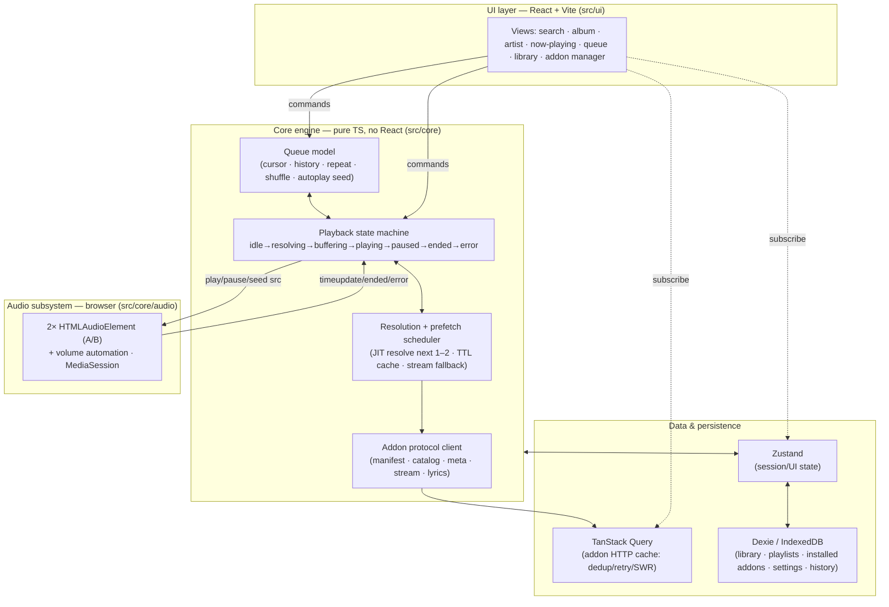

# Player Architecture (web-only v1)

This is the architecture plan for the `player` repo. It is **deliberately
not a port of stremio-web / stremio-core.** It takes Stremio's *principles*
where they apply and makes independent, web-native choices everywhere the
reasoning behind Stremio's own choices doesn't transfer to a web-only music
player.

> Relationship to the master plan: this document **supersedes** the
> player-specific rows of
> [`IMPLEMENTATION_PLAN.md`](https://github.com/p2p-songs/.github/blob/main/docs/IMPLEMENTATION_PLAN.md)
> §5/§7 (the "Core state pattern = Elm", "music-core", "Storage = idb"
> rows). The rest of the master plan — protocol, addons, `stream-debrid`,
> legal invariants — is unchanged and still authoritative.

---

## 1. What we keep from Stremio, and what we drop

Stremio-core is an Elm-style state machine (`Msg → Effects → Model`) written
in **Rust, compiled to WASM/JNI/native**. It's a beautiful design — *for the
problem Stremio has*, which is: **run one identical core on web, desktop,
Android, iOS, and TV.** The Elm-in-Rust decision is downstream of that
cross-platform constraint. Predictable state was the goal; "one verified
core binary everywhere" was the reason it's Rust and the reason it's a single
monolithic model.

**We said web-only. That constraint is gone, so the decision it forced is
gone with it.** Copying Elm-in-Rust here would be imitating the *answer* to a
question we're not asking.

| Stremio principle | Keep? | Web-only music reasoning |
|---|---|---|
| UI-agnostic, headless-testable engine | **Keep** | Still hugely valuable: the queue/playback/resolution logic must be testable without a browser or a real addon, and swappable under any UI. We enforce this as an internal boundary (§8), not a Rust FFI boundary. |
| Local-first state, no mandatory account | **Keep** | Library, playlists, installed addons, settings all live client-side. Matches Stremio and suits a personal-use tool. |
| Predictable, unidirectional state | **Keep the property, drop the mechanism** | We get this from an explicit state machine *scoped to playback* (§4) + a normal reactive store, not from one hand-rolled global `Msg/Effect` runtime. |
| Addon protocol client (fetch manifest/catalog/meta/stream/lyrics) | **Keep** | This is the whole point of the system. But on web, HTTP caching/dedup/retry/stale-while-revalidate is a *solved problem* (§6) — Stremio hand-rolled it in Rust because Rust had no TanStack Query. |
| Elm `Msg → Effects → Model` as the global architecture | **Drop** | Ceremony without payoff for a single-target TS app. Replaced by layered concerns (§3). |
| Rust / WASM core | **Drop (for v1; reconsider only if a native shell is ever built)** | No cross-platform target = no reason to pay the Rust+WASM+bridge toolchain cost. |
| One monolithic Model | **Drop** | Music state is heterogeneous: fast-changing playback state, cache-like addon responses, and durable library data have *different* lifetimes and want different tools. Forcing them into one model is worse, not better. |

---

## 2. What's actually different about music (the first-principles part)

The architecture is driven by the ways audio streaming is *not* like video
streaming. These differences, not Stremio's code, decide the design.

| Dimension | Video (Stremio) | Music (us) | Architectural consequence |
|---|---|---|---|
| Item length | ~45–120 min | ~3–4 min | You cross a track boundary constantly. Transitions are the hot path. |
| Session shape | Watch **one** thing | Play **dozens** in a row | **The queue is the central object,** not "the current stream." |
| Resolution latency tolerance | Seconds are fine before a movie | Any stall between tracks feels broken | **Stream resolution must be prefetched and hidden** (§5). This is the single most important idea in this doc. |
| Transitions | "Next episode" (coarse) | Gapless / crossfade (sub-second, seamless) | Dedicated audio subsystem with dual elements + volume automation (§4b). |
| Interaction rate | Low (pick, watch) | High (skip, skip, reorder, shuffle) | State changes must be cheap and predictable → explicit playback machine. |
| Library size | Small watchlist | Thousands of tracks/playlists | Persistence layer needs **indexed local queries/search** (§6), not a JSON blob. |
| Foreground? | Full-screen, foreground | Background/ambient, other tabs, screen off | **MediaSession + PWA** are first-class, not polish (§4c, §7). |
| Endless play | Rare | Expected (radio/autoplay) | Queue must be **extendable from a seed source**, not a fixed list (§4a). |
| Link lifetime | Resolve once, watch | Debrid links can **expire**; you resolve ~60 times/hour | Resolve **just-in-time** for the next 1–2 tracks with a TTL cache — never resolve the whole queue upfront (§5). |

If you get exactly one thing right in this repo, it's the row in bold:
**decoupling resolution from playback.** Everything else is comparatively
standard web app engineering.

---

## 3. Layered architecture

Rather than one Elm model, four layers with clear ownership. Data flows up
via subscriptions; commands flow down via method calls / events.



**Why this beats one monolithic model:** the four data concerns have
genuinely different lifetimes. Playback state is ephemeral and changes many
times per minute (state machine). Addon responses are cache-like — fetch,
reuse, expire (TanStack Query). Library data is durable and queried
(Dexie). UI/session state is glue (Zustand). One model would force one
lifetime policy on all four.

---

## 4. The core engine

Lives in `src/core`, **imports nothing from React or the DOM UI** (audio
element access is allowed — it's a platform API, isolated in `core/audio`).
Fully unit-testable headless with a fake audio backend and a fake resolver.

### 4a. Queue model

The queue is the heart of the player. It is an explicit data structure, not
an array in a component.

**Identity is by stable ID, never by array index.** An early draft used a
numeric `cursor` into `items` plus a separate `order` permutation and left
"advance" semantics undefined — that made position ambiguous the moment you
shuffle, insert, or remove (and made "up next" wrong under shuffle). The queue
is modeled on **stable `QueueItemId`s** and two ID sequences:

```ts
type RepeatMode = "off" | "one" | "all";
type QueueItemId = string;    // stable, unique per queue entry (same track can appear twice)

interface QueueItem {
  id: QueueItemId;
  track: TrackRef;            // { mbid, title, artist, album, durationMs, artwork } — persistable
  resolution: ResolutionState; // idle | resolving | resolved(streams, chosenIdx, url, expiresAt?) | failed
                              // MEMORY-ONLY: never persisted; forced to `idle` on hydration (§6).
                              // `expiresAt` is optional and only ever a hint (§5) — the protocol
                              // may not supply it; correctness never depends on it.
}

interface Queue {
  itemsById: Record<QueueItemId, QueueItem>;
  canonicalOrder: QueueItemId[]; // the order the user built (playlist/album order); stable
  playOrder: QueueItemId[];      // the order playback actually follows — equals canonicalOrder
                                //   when shuffle is off; a derived shuffled sequence when on
  currentItemId: QueueItemId | null; // position IS an id, never an index
  repeat: RepeatMode;
  shuffle: boolean;
  autoplaySeed?: RadioSeed;   // when the current item nears the end of playOrder, extend from this
}
```

Design rules (mutation invariants — define these before writing queue code):
- **Position is `currentItemId`.** "Next"/"prev" step along **`playOrder`**,
  not `canonicalOrder`. **"Up next" reads from `playOrder`** after the current
  id — this is the fix for the shuffle bug in the earlier model.
- **Non-destructive shuffle:** toggling shuffle only recomputes `playOrder`
  (turning it on derives a shuffle of the remaining ids, keeping `currentItemId`
  first; turning it off restores `playOrder = canonicalOrder`). `canonicalOrder`
  and `itemsById` are never mutated by shuffling.
- **Insert/remove/reorder** operate on ids and must keep `canonicalOrder`,
  `playOrder`, and `itemsById` consistent (removing an id removes it from both
  sequences; if it was current, advance `currentItemId` along `playOrder`
  first). Never let a stale index outlive the mutation.
- **Same track twice is legal** (distinct `QueueItemId`s) — playlists and radio
  routinely repeat tracks.
- **Autoplay/radio** appends ids when the current item nears the end of
  `playOrder`, from a seed (a track/artist → "similar" via a catalog addon or
  ListenBrainz). The queue is potentially infinite; the model must never assume
  it's finite (see §4b for how this interacts with the failure circuit-breaker).

### 4b. Playback state machine

Playback is a genuine state machine with tricky async edges (resolve →
buffer → play, user skips mid-resolve, seek, stream failure → fallback).
Modeling it explicitly is where we recapture Stremio's "predictable state"
principle — **scoped to the one place it earns its keep**, not spread across
the whole app.

```
        ┌──────── skip / new selection ────────┐
        ▼                                       │
idle → resolving → buffering → playing ⇄ paused │
        │             │           │             │
        │             │           └── ended ────┤ (advance: repeat/next/radio)
        └── failed ◄───┘  (try next stream in list, else skip-ahead)
```

- Entering `resolving` triggers the scheduler (§5) for the *current* item if
  not already resolved (usually it is, thanks to prefetch).
- `failed` for a single item: try the next `stream` in the item's resolved
  list (a stream addon returns several — qualities/sources); if all fail,
  skip-ahead to the next item. But skip-ahead is **bounded** — see
  "Failure termination" below; it does not loop forever.
- Seeking is handled by the audio element natively (HTTP `Range`), the
  machine just tracks position for UI/MediaSession/scrobble.

**Stale-completion safety (identity, not just abort).** Async resolves/loads
race with skips and reorders. AbortController is used to cancel superseded
work, but abort races with completion and not all work honors it — so
**cancellation is an optimization; identity validation is the correctness
mechanism.** Every resolve/load attempt is stamped with an immutable
`{ sessionEpoch, queueItemId, attemptId }`:

- `sessionEpoch` bumps whenever the queue is replaced or the current item
  changes; `queueItemId` ties the work to a specific queue entry (§4a);
  `attemptId` distinguishes retries of the same item.
- Every `resolved` / `failed` event carries its stamp, and the reducer
  **ignores any event whose stamp doesn't match current state** (wrong epoch,
  wrong current item, or a superseded attempt). A resolve that completes after
  you've skipped away simply gets dropped; it can never overwrite the current
  item's resolution, preload the wrong URL, or push the FSM to `buffering` for
  a track no longer selected.
- Test matrix (required): resolve-after-skip, failure-after-success,
  reorder-during-resolve, and double-completion.

**Failure termination (the queue must be able to stop).** "Never freeze" does
not mean "skip forever." A provider outage must not become an unbounded
resolve→fail→skip loop that hammers debrid APIs and grows the radio queue while
the UI looks busy. Rules:

- Track a **failure sweep** per playback session. If every *eligible* item has
  failed once with no successful play in between — or after a bounded
  consecutive-failure threshold — stop and surface an **actionable terminal
  state** (`error`), not silent spinning.
- The breaker **resets** on a successful play or an explicit user action
  (manual pick, retry).
- **Provider-wide failures** (an addon globally unreachable / auth-failing)
  get exponential backoff, not per-track retries.
- **`repeat: "all"` and autoplay/radio must not bypass the bound** — a wrap or
  an appended radio batch of unresolvable items still counts against the sweep.

**Decision: a hand-rolled discriminated-union finite state machine** (state
is a union like `{ status: "playing"; … } | { status: "resolving"; … }`;
transitions are a pure `(state, event) => state` function). It gets the
"impossible states impossible" benefit because the state is a discriminated
union and transitions are total, not a bag of boolean flags — with zero
runtime deps. The genuinely hard async (resolve → buffer with
cancellation/TTL/fallback) lives in the **scheduler** (§5), not here — so the
machine itself is a small, mostly synchronous lifecycle FSM reacting to
events (`ended`, `error`, `skip`, `resolved`), which is exactly a reducer's
sweet spot; a statechart library would add idioms without adding much value
at this size. **Escape hatch:** it's isolated behind `core/playback`, so if
the machine ever grows deeply nested, swapping in
[XState](https://stately.ai/) is a contained change.

### 4c. Audio subsystem (`src/core/audio`)

**Two `HTMLAudioElement`s (A/B), ping-ponged.** The idle element preloads the
next track's resolved URL (`preload="auto"`); on `ended` (or a crossfade
point) the roles swap, with volume automation on the two elements.

**Be precise about what this does and doesn't guarantee** — these are two
different features with different achievability:

- **Crossfade (deliberate overlap):** always achievable. Start the next
  element and ramp `volume` down/up over an overlap window. No sample-accuracy
  needed; this is the robust default and works regardless of CORS.
- **True gapless (no silence between tracks):** *not* guaranteed by "swap on
  `ended`" alone. An `ended` event followed by a JS-triggered `play()` is
  subject to event-loop delay, browser buffering/throttling policy,
  codec/container encoder padding (MP3/AAC add silence at file boundaries),
  and autoplay restrictions — any of which can produce an audible gap even
  when the code is correct. Dual-element swap gets us *close*, but it is not a
  sample-accurate scheduling contract. Sample-accurate gapless would require
  Web Audio buffer scheduling (which hits the CORS-taint wall noted below) or
  format-aware handling, and is explicitly **not** promised for v1.

**Measured criterion, not an absolute claim.** "Gapless" is validated against
a target, not asserted: inter-track silence below a defined threshold (e.g.
≤ ~20 ms) on a named **browser × codec matrix** (at minimum current
Chromium + Firefox + WebKit, with FLAC and MP3/AAC fixtures), exercised by an
**integration test using controlled same-origin media fixtures** (not live
addon streams). Where a codec/browser combination can't meet the threshold
with dual-element swap, the honest fallback is a short crossfade to mask the
seam. This replaces the earlier unqualified "plays a full album gapless"
guarantee.

Key web-specific reasoning:
- **Crossfade via `element.volume` automation, not Web Audio — on purpose.**
  Routing a cross-origin media element through the Web Audio graph
  (`MediaElementAudioSourceNode`) *taints* it unless the source sends CORS
  headers, and **debrid/CDN links frequently won't.** Volume automation on
  the raw `<audio>` element works regardless of CORS. So the core
  crossfade/gapless path deliberately avoids Web Audio.
- **Web Audio is an optional enhancement,** gated on CORS-enabled sources,
  for visualizer/EQ only — never on the critical playback path. Most streams
  won't qualify, and that's fine.
- **`MediaSession API`** wired here: metadata (title/artist/artwork),
  action handlers (play/pause/next/prev/seek) → OS lock screen, media keys,
  Bluetooth controls, notification. This is a headline feature for a
  background music app, not polish.
- The subsystem exposes a narrow interface (`load(url)`, `play()`,
  `pause()`, `seek(ms)`, `preload(url)`, `crossfadeTo(url)`, events) so the
  machine can be tested against a **fake** implementation with no DOM.

---

## 5. Resolution + prefetch scheduler — the centerpiece

The reason a naive "resolve on play" music player feels broken: every track
boundary incurs the full stream-addon round trip (for `stream-debrid`:
indexer query → debrid cache-check → unrestrict), which can be 1–5 s. Users
skip and expect *instant* sound.

**The scheduler decouples resolution from playback:**

1. **Trigger:** when the current track starts (and again at a "~30 s
   remaining" mark as a safety net), asynchronously resolve the **next 1–2
   queue items** — call the stream addon(s), pick the best stream, get the
   playable URL, store it on the `QueueItem` (with the stamp from §4b).
2. **Preload:** hand the resolved next URL to the idle audio element so the
   browser buffers its opening while the current track plays.
3. **On advance:** the next item is already `resolved` + buffered → playback
   starts with no perceptible gap.
4. **Freshness — re-resolve-on-failure is the guarantee; expiry is only a
   hint.** Debrid links can expire, but **the protocol does not reliably tell
   the player when** (see §5a). So the *correctness* mechanism is: if a
   preloaded/played URL fails to load (dead/expired/auth), the machine walks
   the stream fallback list and, failing that, **re-resolves the item fresh**.
   *Additionally*, when the addon supplies an optional `expiresAt`/`maxAge`
   hint (§5a), the scheduler uses it to proactively avoid preloading a URL that
   would die before use, and re-resolves early. Never resolve the whole queue
   upfront — JIT, near-horizon only. Correctness must not depend on the hint
   being present or honest.
5. **Fallback:** a stream addon returns *several* streams per track. The
   scheduler keeps the ranked list; on load failure the machine walks down
   it, then re-resolves, then skips-ahead — within the bounded failure sweep
   (§4b). Resolution failures degrade, never loop forever.
6. **Cancellation + identity:** if the user reorders/skips, in-flight
   resolutions for items no longer near the current id are cancelled
   (AbortController) to save debrid calls — but cancellation is best-effort;
   the reducer's **stamp check (§4b) is what actually prevents a late result
   from committing.**

### 5a. `/stream` is a command, not a cacheable query

Resolving a stream is **not** a passive GET. A `stream-debrid` `/stream` call
is credentialed, rate-limited, and may be **state-changing** (the plan permits
it to trigger a debrid-side download and poll). So `/stream` must **not** run
under the generic TanStack Query policy used for metadata (§6) — automatic
`retry`, `refetchOnWindowFocus`, `refetchOnReconnect`, or stale-revalidation
would silently repeat expensive/rate-limited work (merely focusing a tab could
burn debrid quota or spawn a duplicate torrent job, and two refetches could
race two different bearer URLs).

The player therefore splits addon calls into two planes:

- **Metadata query plane** — `manifest` / `catalog` / `meta` / `lyrics`:
  ordinary TanStack Query (dedupe, cache, SWR, retry). These are safe,
  idempotent reads.
- **Resolution command plane** — `/stream`: a **scheduler-owned command**, not
  a cache entry. Explicit in-flight **deduplication by operation id**,
  `retry: false` (or a narrowly-classified retry only on clearly-transient
  network errors), `refetchOnWindowFocus: false`, `refetchOnReconnect: false`,
  **memory-only** results, and the §4b stamp on every attempt. If TanStack
  Query is still used as the raw transport, `/stream` keys get a **separate,
  immutable policy factory** that hard-disables all of the above — it is never
  allowed to inherit the metadata defaults.

This component is pure logic over the addon client + queue, so it's
**fully unit-testable** with a fake resolver that simulates latency,
expiry, failure, and duplicate/late completion.

---

## 6. Data & persistence

| Concern | Tool | Why (web-native reasoning) |
|---|---|---|
| Metadata reads: `manifest` / `catalog` / `meta` / `search` / `lyrics` | **TanStack Query** (normal policy) | Caching, dedup, retries, SWR, parallel fan-out across installed addons, cancellation — the machinery stremio-core hand-writes in Rust, already solved on web. Merge/dedup by MBID on top. |
| Stream resolution: `/stream` | **Scheduler-owned command, NOT the generic query policy (§5a)** | `/stream` is credentialed, rate-limited, possibly state-changing (debrid download/poll). Runs with in-flight dedup by operation id, `retry: false`, no focus/reconnect refetch, memory-only results, §4b stamping. Never inherits metadata query defaults. |
| Durable library: saved tracks/albums/artists, playlists, play history | **Dexie (IndexedDB)** | A music library grows to thousands of items and needs **indexed local search/filter/sort** — that wants a queryable store, not a JSON blob. (`idb` is the lighter fallback if v1 library stays small; Dexie recommended because local library search is a core music-app expectation.) |
| Installed addon URLs + cached manifests | **Dexie**, in a dedicated **secret-bearing store** (§6a) | A *configured* addon URL contains the addon's config, which for `stream-debrid` includes a debrid API key — so this store holds credential material and is handled accordingly (§6a). |
| Session / UI state (current view, queue snapshot, volume, mini-player) | **Zustand** | Tiny, framework-light, subscribe from React or from the engine. Queue + playback *snapshots* are mirrored here for the UI to render; the engine remains the source of truth. |

Persistence policy — **persist identity, not resolved media.** A thin adapter
debounces durable state into Dexie so a reload restores your session, but it
persists **only**: library, playlists, installed addon URLs, settings, and the
queue's *identity* — `itemsById` (track metadata), `canonicalOrder`,
`playOrder`, `currentItemId`, `repeat`, `shuffle` (§4a). It does **not**
persist:

- **Resolved stream URLs / `QueueItem.resolution`.** These are memory-only.
  Direct debrid/CDN links are bearer URLs that expire; persisting them would
  restore stale, secret-bearing links that must be re-resolved anyway.
  **On hydration, every restored `QueueItem` is forced to `resolution: idle`,**
  so the JIT scheduler (§5) re-resolves the current/next items fresh. This
  also means a reload never plays from a persisted expired link.
- **TanStack Query's addon-response cache** (which includes `/stream`
  responses). It stays an in-memory cache; it is not persisted to disk. If
  query persistence is ever added for offline metadata, `/stream` responses
  are excluded.

No server, no account; everything is local to the device.

### 6a. Credential handling for configured addons

**Honest classification: a configured stream addon's manifest URL is itself a
bearer secret, and the player holds it.** The `/configure` model encodes the
addon's config — for `stream-debrid`, the debrid API key — into the manifest
URL path (`https://stream-debrid.example/<config>/manifest.json`). The player
must hold that URL to call the addon at all, so there is no design in which
the player "doesn't have the key": if it can call a configured addon, it holds
the credential. An earlier draft claimed "debrid keys never live in the
player" — that was **false** and is corrected here. (It stays true that the
player never has its *own* debrid account and never bundles credentials; the
key is the *user's*, entered by them, and — because it travels only in the
URL the user pasted — it stays on the user's own device and is sent only to
the addon they configured. That's a fine trust model; it just has to be
handled as the secret it is.)

**The real threat is same-origin script, not accidental cross-store reads.** A
separate Dexie object store is *organization, not a security boundary* — any
same-origin JavaScript (or a successful XSS) can read the raw key-bearing URL
regardless of which store it's in. So this is called a **secret-bearing
store**, deliberately **not** a "keychain" (that word implies an OS-level
security boundary the browser doesn't give us here). Client-side encryption
without a user-held key is **not** a solution and won't be presented as one —
it doesn't stop same-origin code, which already runs with the key's privileges.

Because the realistic exfiltration path is injected/malicious same-origin code
— and this app deliberately runs **themeable UI** (§7a) and PWA/analytics code
in that same origin — the v1 **browser threat model** is an explicit
requirement, not a nicety:

- **Strict CSP** with no `unsafe-inline` / `unsafe-eval`; **Trusted Types**
  where supported.
- **No remote theme or plugin code, ever.** Themes (§7a) are first-party,
  bundled, reviewed code — never fetched/eval'd from a URL at runtime. (This is
  now a hard invariant on the theming feature, §7a/§11.)
- **Dependency + telemetry discipline:** minimize third-party runtime deps in
  the app origin; no analytics/telemetry that could capture URLs or state.
- **Redacted error boundaries:** crash/error paths must not serialize
  configured URLs into messages, stack frames, or reports.

Handling rules (implementation requirements, auditable):

- **Stored as credential material** in the dedicated secret-bearing store,
  separate from non-sensitive state (organization, on top of — not instead of —
  the threat model above).
- **Never logged or exported in the clear:** never written to `console`, error
  telemetry, diagnostics, analytics, or any bug-report/export blob. Anywhere a
  URL is shown or copyable in the UI, the config segment is **redacted** (show
  addon name + host, mask `<config>`).
- **Never cached by the service worker / HTTP cache.** The PWA service worker
  (§7) must exclude configured-addon requests from any cache; only the addon's
  *responses* it's allowed to cache (metadata/artwork) may be cached, never the
  request URL as a cache key in a way that persists the secret. **Tested:** an
  automated test asserts configured URLs never appear in any SW/HTTP cache.
- **Deletable / rotatable:** removing an addon purges its stored URL; there's a
  path to re-paste an updated URL (rotated key).
- **Local-only:** never synced anywhere (consistent with the no-account model).

*Future option (not v1):* an opaque config identifier — the addon stores the
real config server-side keyed by a random ID, and the URL carries only the ID.
Rejected for v1 because it makes the addon **stateful** and moves the user's
debrid key onto the addon operator's server, which is a *worse* posture for a
"your own credentials, your own device" tool than keeping the key client-side
and handling it as a secret.

---

## 7. UI & platform

- **React + Vite + TypeScript.** Fast dev loop, huge ecosystem, and it keeps
  the door open to React Native / Tauri reuse later without committing now.
- **Routing:** TanStack Router (type-safe) or React Router — minor, decided at
  build time; type-safe router preferred to match the TS-first stance.
- **PWA from the start:** service worker + web manifest → installable,
  runs in its own window, background audio, offline-cached metadata and
  artwork. For a *web-only* music player this is what buys the "feels like a
  real app" property that Stremio gets from being a native shell. It's an
  architectural decision (affects caching, asset strategy), not late polish.
- **Styling:** deferred, low-stakes — any of CSS Modules / Tailwind / vanilla-extract.
  Not an architectural dependency; pick during UI phase. Whatever's chosen
  drives its visuals off the theme **token layer** (§7a) rather than
  hardcoded values.
- **YouTube path:** for `stream-ytmusic` streams (`ytId`), playback is the
  YouTube IFrame player, not the `<audio>` subsystem. The playback machine
  treats "YT-backed item" as an alternate audio backend behind the same
  interface, so the queue/scheduler don't care which backend a given item uses.

### 7a. Theming — pluggable UI, not a hardcoded look

Yes: the look-and-feel is a **drop-in**, not baked in. This falls out of the
`core`/`ui` boundary (§8a) almost for free — if the engine owns all state and
behavior and the UI only renders it, then the UI is *itself* swappable.
"Retro", "minimal", "modern" become selectable themes, switchable at runtime,
addable without touching the engine.

There are two tiers of "theme", and real themes use a mix of both:

**Tier 1 — token themes (skinning).** A theme is a set of **design tokens** —
palette, typography, spacing, radii, shadows, motion — exposed as CSS custom
properties (`--color-bg`, `--font-display`, `--radius`, `--motion-scale`, …).
Components read tokens, never hardcoded values, so a token swap restyles the
whole app at runtime with zero layout change. This covers variants that share
structure (e.g. "modern light" vs "modern dark" vs "high-contrast").

**Tier 2 — component themes (reskinning the structure).** Some themes are
*structurally* different, not just recolored: the retro theme has a spinning
vinyl and A/B-side framing; a minimal theme is a tight list with no artwork
chrome. That's not a token swap — the theme supplies its **own components**.
To make that a clean drop-in we separate behavior from presentation:

- **Headless view-model hooks** (`src/ui/viewmodels/`): per surface —
  `useNowPlaying()`, `useQueue()`, `useBrowse()`, `useSearch()`,
  `useLibrary()`, `useLyrics()`, … — pure adapters over the engine that
  return data + bound commands (`{ track, isPlaying, positionMs, toggle,
  next, prev, seek, … }`). Theme-agnostic; every theme consumes these.
- **A typed theme contract** (`src/ui/theme-contract.ts`): the set of
  *surfaces* a theme may implement (`NowPlaying`, `Queue`, `MiniPlayer`,
  `Browse`, `Search`, `Library`, `AddonManager`, `Lyrics`) and the props each
  receives. Surfaces are marked required vs optional, so a spartan theme can
  omit e.g. `Lyrics` and the app degrades gracefully.
- **A theme = a folder/module** implementing that contract (its components +
  its token set). A **theme registry + `ThemeProvider`** picks the active one,
  supplies its tokens as CSS vars, and renders its surfaces. The selected
  theme is persisted like any other setting (Zustand → Dexie).

```
src/ui/
  viewmodels/        # headless hooks over the engine — theme-agnostic
  theme-contract.ts  # typed surface interface every theme is checked against
  primitives/        # token-driven shared atoms (button, slider, scrubber) themes may reuse
  themes/
    retro/           # own components (spinning vinyl…) + tokens
    minimal/         # own components (list-first…) + tokens
    modern/          # …
  ThemeProvider.tsx  # registry + runtime switch + token injection
```

Because every theme is wired to the same headless hooks, dropping in a new
one is: add a folder, implement the required surfaces (reuse `primitives/`
where you can), register it. The engine, scheduler, queue, and data layers
are untouched.

**Scope discipline (so this doesn't balloon):** build the *seam* — headless
hooks + theme contract + token layer + one reference theme — during the UI
phase (P-5), but **ship exactly one theme first**, authored against the
contract. That proves the seam and makes theme #2 a genuine drop-in, without
paying up front to build three UIs. Add more themes when they're actually
wanted. A base theme plus themes that override only a few surfaces (inheriting
the rest) keeps the per-theme cost down.

**Security constraint (hard invariant): themes are first-party, bundled code —
never remote code.** Themes run in the same origin as the credential store
(§6a), so a theme fetched or `eval`'d from a URL at runtime could exfiltrate a
configured addon's debrid key. Themes must be reviewed, in-repo, build-time
code only. This is why the "distribute themes separately, like addons" idea
below is a **non-goal for v1**: pluggable *sources* (addons) are safe because
they're separate network services the player only exchanges data with;
pluggable *UI* would be foreign code in the player's own origin, which is a
credential-theft vector. *(If external themes are ever revisited, they'd need a
real sandbox — separate origin / iframe / worker — not just the contract.)*

---

## 8. Engine/UI boundary & repo structure

**Single Vite app, one hard internal boundary — not a monorepo (yet).** The
current master-plan sketch had `music-core` and `player-app` as separate
packages; for a single web target that's premature ceremony. Instead:

```
player/
  src/
    core/            # PURE engine — no React, no UI imports. The "music-core".
      queue/         #   queue model + operations
      playback/      #   hand-rolled discriminated-union FSM (§4b)
      scheduler/     #   resolution + prefetch
      addon/         #   protocol client (uses @p2p-songs/protocol types)
      audio/         #   audio backends (html-audio, youtube, fake) behind one interface
      persistence/   #   Dexie schema + adapters
    ui/              # may import from core, never vice versa
      viewmodels/    #   headless per-surface hooks over the engine (theme-agnostic) — §7a
      theme-contract.ts  # typed surface interface every theme implements — §7a
      primitives/    #   token-driven shared atoms themes may reuse
      themes/        #   drop-in themes (retro/ minimal/ modern/…): components + tokens — §7a
      ThemeProvider.tsx  # theme registry + runtime switch + token injection
    app/             # Vite entry, router, providers (TanStack Query, stores)
  docs/
    ARCHITECTURE.md  # this file
  tests/             # headless engine tests (fake audio + fake resolver)
```

- The `core → ui` one-way rule is **enforced by an ESLint import boundary
  rule**, so the "headless, UI-agnostic engine" property is mechanical, not
  aspirational. This is the web-native equivalent of Stremio's Rust FFI
  boundary — same guarantee, no FFI.
- If a native shell (Tauri) or second UI ever appears, `src/core` promotes to
  a package with a one-line move. We pay that cost only if it's ever real.

**Protocol types sharing — decided:** the addon protocol's TypeScript types
(manifest, stream object, resource shapes) are the wire contract between
addons and the player, so they get **one source of truth**, not a copy on
each side that can silently drift. Canonical home is the **`addon-sdk` repo**
(the SDK is literally the tool for implementing the protocol, so the contract
belongs with it), exported as a types-only `@p2p-songs/protocol` package that
this repo depends on. Mechanics during early churn: consume it as a **pinned
git dependency** to avoid a publish-on-every-change treadmill while the
protocol is pre-1.0; promote to a properly published npm / GitHub Packages
release when the protocol stabilizes at v1. Finalized packaging details land
in the `addon-sdk` repo's own plan, since that's where the package lives.

### 8a. The boundary *enables* the UI/UX — it doesn't limit it

A concern worth putting on the record so it isn't relitigated later: does a
strict `core`/`ui` split get in the way of building a rich, characterful,
animated interface? **The opposite — the split is what makes a free-form UI
cheap and safe.**

`src/core` dictates **zero pixels.** It owns *state and behavior* (what's
playing, what's next, position, shuffle/repeat, which addon resolved the
stream, lyrics availability) and exposes that as plain, typed, reactive data.
`src/ui` is then free to render that data in any visual language whatsoever —
custom fonts, bespoke animations (a spinning-vinyl now-playing screen, a
canvas visualizer), any palette, any layout, multiple alternate views of the
same state (full now-playing ⇄ mini-player) — without the engine knowing or
caring. Restyling, re-animating, or completely reskinning the app touches
only `src/ui` and never risks the playback/queue/resolution logic.

Concretely, a fully-featured now-playing screen maps entirely onto data the
engine already exposes — no engine change is needed to build an ambitious UI:

| A rich now-playing / queue UI wants… | …reads from (already in the engine) |
|---|---|
| Track title / artist / album / year / artwork | current `QueueItem.track` (from `musicmeta`) |
| "Up next" list | `Queue.playOrder` after `currentItemId` (§4a) — follows *play* order, so it's correct under shuffle |
| "Autoplay radio (based on this album/artist)" section | `Queue.autoplaySeed` + radio extension (§4a) |
| Queue ⇄ Lyrics tabs | queue from engine; lyrics from the `lyrics` addon resource |
| Progress bar + elapsed/total time | playback machine position + `track.durationMs` (§4b) |
| Shuffle / repeat / skip / play-pause controls | commands into the playback machine + queue; non-destructive shuffle & repeat modes already modeled (§4a/§4b) |
| "Streaming from: <source>" indicator | which addon/stream the scheduler resolved (§5) |
| Minimize → mini-player (same state, different skin) | any number of views subscribing to the same engine state |

So the design rule for the UI phase (P-5): **the UI subscribes to engine
state and issues commands; it never owns playback/queue logic.** That is
exactly what keeps the visual layer unconstrained — you can build whatever
UX you want on top, and change it freely later, because none of it is load-
bearing for correctness.

---

## 9. Decisions

1. **Playback machine → hand-rolled discriminated-union FSM (decided).**
   The earlier lean was XState; on reflection the reducer wins here because
   (a) the hard async — resolution, prefetch, cancellation, TTL, fallback —
   lives in the *scheduler* (§5), so the machine is a small, mostly
   synchronous lifecycle FSM where a statechart library adds idioms without
   adding much value; (b) it's isolated behind `core/playback`, so adopting
   XState later is a contained change if the machine ever grows. Discriminated-
   union state + total transition function preserves the impossible-states-
   impossible guarantee. *(See §4b.)*
2. **Library store → Dexie (decided).** A music library grows to thousands of
   items and needs indexed local search/filter/sort — that wants a queryable
   store, not a JSON blob. `idb` was the "keep v1 tiny" fallback; the cost of
   Dexie is low and local library search is a core music-app expectation, so
   pay it now. *(Swappable behind `core/persistence` if it ever bites.)*
3. **Protocol types → shared `@p2p-songs/protocol`, single source of truth in
   the `addon-sdk` repo (decided).** One wire contract, not a per-repo copy
   that can drift. Consumed here as a pinned git dependency during pre-1.0
   churn, promoted to a published package at protocol v1. *(See §8; final
   packaging mechanics are settled in the `addon-sdk` repo plan.)*
4. **Styling system → deferred to the UI phase (P-5), by design.** No
   architectural impact; the `core`/`ui` boundary (§8a) means the visual
   layer is unconstrained and can be chosen — and changed — freely later.
   Whatever's picked must drive visuals off theme tokens, since the UI is
   **themeable/pluggable** (§7a), not a single hardcoded look.

None of these block starting Phase P-1; all are isolated behind the module
boundaries above.

---

## 10. Build phases (this repo)

Engine-first and headless-first, so the hard parts (queue, machine,
scheduler) are proven with fakes before a browser or a real addon is in the
loop — the same "headless core first" discipline as the master plan, applied
locally.

| Phase | Deliverable | Depends on |
|---|---|---|
| **P-0** | This architecture doc; confirm §9 decisions | — |
| **P-1** | Headless engine skeleton: queue model (stable-ID identity, §4a) + playback machine + scheduler, driven by a **fake** audio backend and **fake** resolver. Unit tests of transitions, shuffle/repeat, prefetch, fallback, **the §4b async-race matrix** (resolve-after-skip, failure-after-success, reorder-during-resolve, double-completion) and the **failure circuit-breaker** (§4b). **No browser, no addons.** | — |
| **P-2** | Real audio subsystem: dual `<audio>` + volume-automation crossfade + MediaSession, wired to the machine, playing **hardcoded direct URLs**. | P-1 |
| **P-3** | Real addon client + scheduler integration: metadata via TanStack Query (normal policy); **`/stream` via the resolution command plane** (§5a — dedup, no retry/refetch, memory-only, stamped); JIT resolve + re-resolve-on-failure + optional expiry hint (§5a) against a real stream addon. | P-1, `addon-sdk` + `stream-legal` existing |
| **P-4** | Persistence + data layer: Dexie (library, playlists, installed addons, settings, history); catalog fan-out/merge across installed addons. | P-3 |
| **P-5** | UI: search/browse, artist/album, now-playing, queue, library, addon manager (install by manifest URL). Build the **theming seam** here — headless viewmodels + typed theme contract + token layer — and ship **one** reference theme against it (§7a), so further themes are drop-ins. | P-2, P-3, P-4 |
| **P-6** | PWA polish: service worker, installability, offline metadata/artwork, background-audio hardening. | P-5 |

Cross-repo note: **P-1 and P-2 have no external dependency** and can start
immediately. P-3 onward needs `addon-sdk` and at least `stream-legal` /
`musicmeta` from the `addons` repo to exist for real integration (fakes carry
P-1/P-2).

---

## 11. Invariants this architecture must preserve

(For the adversarial reviewer — these refine
[`REVIEW_CHECKLIST.md`](https://github.com/p2p-songs/.github/blob/main/docs/REVIEW_CHECKLIST.md)
§1/§7/§8 for the player specifically.)

- **Neutrality:** still no bundled/default-installed stream addon; addons are
  added only by user-pasted manifest URL. The player never has its *own*
  debrid account and never ships credentials. (Unchanged from master plan §3.)
- **Configured addon URLs are secrets, handled under a real browser threat
  model (§6a):** the player *does* hold the user's key inside the configured
  manifest URL — unavoidable if it's to call the addon — so it's stored in a
  secret-bearing store (not a "keychain" — same-origin script can read it),
  never logged/exported/telemetered, redacted in UI, excluded from SW cache,
  and protected by strict CSP + no-remote-code. (Corrects the earlier false
  "no secrets in the player" claim.)
- **No remote UI code (§6a/§7a):** themes/plugins are first-party bundled code
  only; never fetch/`eval` UI code at runtime — it would run in the origin that
  holds the credential.
- **Resolved media is memory-only (§6):** resolved stream URLs /
  `QueueItem.resolution` and any `/stream` result are never persisted; on
  hydration every queue item is forced to `resolution: idle` and re-resolved
  JIT. Persisting bearer stream links is an anti-pattern — flag it.
- **`/stream` is a command, not a cached query (§5a):** it never runs under the
  generic TanStack Query retry/SWR/focus-refetch policy — that would repeat
  credentialed, rate-limited, possibly state-changing debrid work. Metadata
  and resolution are separate planes.
- **Stream freshness = re-resolve-on-failure (§5/§5a):** correctness never
  depends on a protocol `expiresAt`; that field is an optional optimization
  hint. A dead link is recovered by falling down the stream list / re-resolving.
- **Async results commit by identity, not just abort (§4b):** every
  resolve/load is stamped `{sessionEpoch, queueItemId, attemptId}`; the reducer
  drops any completion whose stamp doesn't match current state. Relying on
  AbortController alone is a defect.
- **Queue identity is by stable ID (§4a):** `currentItemId` + `playOrder`,
  never a mutable array index; "up next" reads from `playOrder`. Index-as-
  identity under shuffle/insert/remove is a defect.
- **Failure is bounded (§4b):** skip-ahead runs inside a per-session failure
  sweep with a terminal error state and provider backoff; `repeat: "all"` /
  autoplay must not create an unbounded fail/skip loop.
- **Engine purity:** `src/core` must not import from `src/ui` — enforced by
  lint. The engine stays headless-testable.
- **Resolution is JIT, never whole-queue:** resolving the entire queue upfront
  (leaking/expiring debrid links, hammering debrid APIs) is an
  anti-pattern and should be flagged if it appears.
- **Gapless is a measured target, not an absolute (§4c):** true gapless is not
  guaranteed by dual-element swap; it's validated against a silence threshold
  on a browser×codec matrix, with crossfade as the fallback. Don't treat "plays
  gapless" as an unconditional guarantee.
- **Superseded invariant:** REVIEW_CHECKLIST §8's "music-core stays Elm-style
  `Msg→Effects→Model`" is **intentionally retired** by this document — the
  Elm mechanism was a means to predictable state, and we achieve that via the
  scoped playback machine instead. The checklist has been updated to match;
  an auditor should treat the *absence* of an Elm runtime here as correct,
  not as drift.
