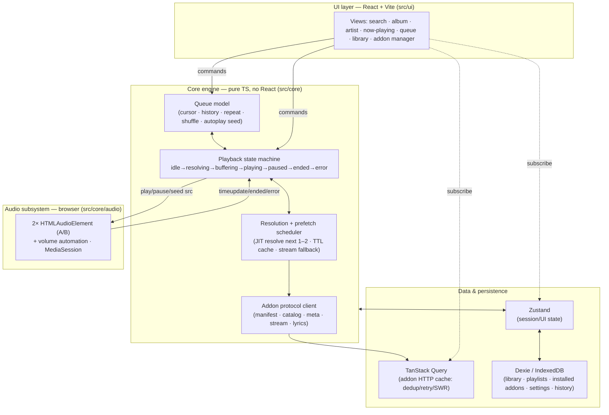

# Player Architecture (web-only v1)

This is the architecture plan for the `player` repo. It is **deliberately
not a port of stremio-web / stremio-core.** It takes Stremio's *principles*
where they apply and makes independent, web-native choices everywhere the
reasoning behind Stremio's own choices doesn't transfer to a web-only music
player.

> Relationship to the master plan: this document **supersedes** the
> player-specific rows of
> [`IMPLEMENTATION_PLAN.md`](https://github.com/p2p-songs/.github/blob/main/docs/IMPLEMENTATION_PLAN.md)
> §5/§7 (the "Core state pattern = Elm", "music-core", "Storage = idb"
> rows). The rest of the master plan — protocol, addons, `stream-debrid`,
> legal invariants — is unchanged and still authoritative.

---

## 1. What we keep from Stremio, and what we drop

Stremio-core is an Elm-style state machine (`Msg → Effects → Model`) written
in **Rust, compiled to WASM/JNI/native**. It's a beautiful design — *for the
problem Stremio has*, which is: **run one identical core on web, desktop,
Android, iOS, and TV.** The Elm-in-Rust decision is downstream of that
cross-platform constraint. Predictable state was the goal; "one verified
core binary everywhere" was the reason it's Rust and the reason it's a single
monolithic model.

**We said web-only. That constraint is gone, so the decision it forced is
gone with it.** Copying Elm-in-Rust here would be imitating the *answer* to a
question we're not asking.

| Stremio principle | Keep? | Web-only music reasoning |
|---|---|---|
| UI-agnostic, headless-testable engine | **Keep** | Still hugely valuable: the queue/playback/resolution logic must be testable without a browser or a real addon, and swappable under any UI. We enforce this as an internal boundary (§8), not a Rust FFI boundary. |
| Local-first state, with **optional** account sync | **Keep (hybrid)** | Library, playlists, installed addons, settings live client-side and work fully logged-out; logging in backs them up and syncs across devices via a self-hosted backend (§6b). This is Stremio's actual model — local-first + optional account — not pure local-only. |
| Predictable, unidirectional state | **Keep the property, drop the mechanism** | We get this from an explicit state machine *scoped to playback* (§4) + a normal reactive store, not from one hand-rolled global `Msg/Effect` runtime. |
| Addon protocol client (fetch manifest/catalog/meta/stream/lyrics) | **Keep** | This is the whole point of the system. But on web, HTTP caching/dedup/retry/stale-while-revalidate is a *solved problem* (§6) — Stremio hand-rolled it in Rust because Rust had no TanStack Query. |
| Elm `Msg → Effects → Model` as the global architecture | **Drop** | Ceremony without payoff for a single-target TS app. Replaced by layered concerns (§3). |
| Rust / WASM core | **Drop (for v1; reconsider only if a native shell is ever built)** | No cross-platform target = no reason to pay the Rust+WASM+bridge toolchain cost. |
| One monolithic Model | **Drop** | Music state is heterogeneous: fast-changing playback state, cache-like addon responses, and durable library data have *different* lifetimes and want different tools. Forcing them into one model is worse, not better. |

---

## 2. What's actually different about music (the first-principles part)

The architecture is driven by the ways audio streaming is *not* like video
streaming. These differences, not Stremio's code, decide the design.

| Dimension | Video (Stremio) | Music (us) | Architectural consequence |
|---|---|---|---|
| Item length | ~45–120 min | ~3–4 min | You cross a track boundary constantly. Transitions are the hot path. |
| Session shape | Watch **one** thing | Play **dozens** in a row | **The queue is the central object,** not "the current stream." |
| Resolution latency tolerance | Seconds are fine before a movie | Any stall between tracks feels broken | **Stream resolution must be prefetched and hidden** (§5). This is the single most important idea in this doc. |
| Transitions | "Next episode" (coarse) | Gapless / crossfade (sub-second, seamless) | Dedicated audio subsystem with dual elements + volume automation (§4b). |
| Interaction rate | Low (pick, watch) | High (skip, skip, reorder, shuffle) | State changes must be cheap and predictable → explicit playback machine. |
| Library size | Small watchlist | Thousands of tracks/playlists | Persistence layer needs **indexed local queries/search** (§6), not a JSON blob. |
| Foreground? | Full-screen, foreground | Background/ambient, other tabs, screen off | **MediaSession + PWA** are first-class, not polish (§4c, §7). |
| Endless play | Rare | Expected (radio/autoplay) | Queue must be **extendable from a seed source**, not a fixed list (§4a). |
| Link lifetime | Resolve once, watch | Debrid links can **expire**; you resolve ~60 times/hour | Resolve **just-in-time** for the next 1–2 tracks with a TTL cache — never resolve the whole queue upfront (§5). |

If you get exactly one thing right in this repo, it's the row in bold:
**decoupling resolution from playback.** Everything else is comparatively
standard web app engineering.

---

## 3. Layered architecture

Rather than one Elm model, four layers with clear ownership. Data flows up
via subscriptions; commands flow down via method calls / events.



**Why this beats one monolithic model:** the four data concerns have
genuinely different lifetimes. Playback state is ephemeral and changes many
times per minute (state machine). Addon responses are cache-like — fetch,
reuse, expire (TanStack Query). Library data is durable and queried
(Dexie). UI/session state is glue (Zustand). One model would force one
lifetime policy on all four.

---

## 4. The core engine

Lives in `src/core`, **imports nothing from React or the DOM UI** (audio
element access is allowed — it's a platform API, isolated in `core/audio`).
Fully unit-testable headless with a fake audio backend and a fake resolver.

### 4a. Queue model

The queue is the heart of the player. It is an explicit data structure, not
an array in a component.

**Identity is by stable ID, never by array index.** An early draft used a
numeric `cursor` into `items` plus a separate `order` permutation and left
"advance" semantics undefined — that made position ambiguous the moment you
shuffle, insert, or remove (and made "up next" wrong under shuffle). The queue
is modeled on **stable `QueueItemId`s** and two ID sequences:

```ts
type RepeatMode = "off" | "one" | "all";
type QueueItemId = string;    // stable, unique per queue entry (same track can appear twice)

interface QueueItem {
  id: QueueItemId;
  track: TrackRef;            // persistable. Identity is entity-typed MBIDs (Plan §8):
                              //   recordingId: `mbid:recording:<uuid>`  ← THE streamable/cache/dedup key
                              //   trackId?:    `mbid:track:<uuid>`       ← album-context (ordering, disc) only
                              //   releaseId?:  `mbid:release:<uuid>`     ← album grouping / bingeGroup
                              //   + title, artist, album, durationMs, artwork
  resolution: ResolutionState; // idle | resolving | resolved(streams, chosenIdx, url, expiresAt?) | failed
                              // MEMORY-ONLY: never persisted; forced to `idle` on hydration (§6).
                              // `expiresAt` is optional and only ever a hint (§5) — the protocol
                              // may not supply it; correctness never depends on it.
}

interface Queue {
  itemsById: Record<QueueItemId, QueueItem>;
  canonicalOrder: QueueItemId[]; // the order the user built (playlist/album order); stable
  playOrder: QueueItemId[];      // the order playback actually follows — equals canonicalOrder
                                //   when shuffle is off; a derived shuffled sequence when on
  currentItemId: QueueItemId | null; // position IS an id, never an index
  repeat: RepeatMode;
  shuffle: boolean;
  autoplaySeed?: RadioSeed;   // when the current item nears the end of playOrder, extend from this
}
```

Design rules (mutation invariants — define these before writing queue code):
- **Position is `currentItemId`.** "Next"/"prev" step along **`playOrder`**,
  not `canonicalOrder`. **"Up next" reads from `playOrder`** after the current
  id — this is the fix for the shuffle bug in the earlier model.
- **Non-destructive shuffle:** toggling shuffle only recomputes `playOrder`
  (turning it on derives a shuffle of the remaining ids, keeping `currentItemId`
  first; turning it off restores `playOrder = canonicalOrder`). `canonicalOrder`
  and `itemsById` are never mutated by shuffling.
- **Insert/remove/reorder** operate on ids and must keep `canonicalOrder`,
  `playOrder`, and `itemsById` consistent (removing an id removes it from both
  sequences; if it was current, advance `currentItemId` along `playOrder`
  first). Never let a stale index outlive the mutation.
- **Same track twice is legal** (distinct `QueueItemId`s) — playlists and radio
  routinely repeat tracks.
- **Autoplay/radio** appends ids when the current item nears the end of
  `playOrder`, from a seed (a track/artist → "similar" via a catalog addon or
  ListenBrainz). The queue is potentially infinite; the model must never assume
  it's finite (see §4b for how this interacts with the failure circuit-breaker).

### 4b. Playback state machine

Playback is a genuine state machine with tricky async edges (resolve →
buffer → play, user skips mid-resolve, seek, stream failure → fallback).
Modeling it explicitly is where we recapture Stremio's "predictable state"
principle — **scoped to the one place it earns its keep**, not spread across
the whole app.

```
        ┌──────── skip / new selection ────────┐
        ▼                                       │
idle → resolving → buffering → playing ⇄ paused │
        │             │           │             │
        │             │           └── ended ────┤ (advance: repeat/next/radio)
        └── failed ◄───┘  (try next stream in list, else skip-ahead)
```

- Entering `resolving` triggers the scheduler (§5) for the *current* item if
  not already resolved (usually it is, thanks to prefetch).
- `failed` for a single item: try the next `stream` in the item's resolved
  list (a stream addon returns several — qualities/sources); if all fail,
  skip-ahead to the next item. But skip-ahead is **bounded** — see
  "Failure termination" below; it does not loop forever.
- Seeking is handled by the audio element natively (HTTP `Range`), the
  machine just tracks position for UI/MediaSession/scrobble.

**Stale-completion safety (identity, not just abort).** Async resolves/loads
race with skips and reorders. AbortController is used to cancel superseded
work, but abort races with completion and not all work honors it — so
**cancellation is an optimization; identity validation is the correctness
mechanism.** Every resolve/load attempt is stamped with an immutable
`{ sessionEpoch, queueItemId, attemptId }`:

- `sessionEpoch` bumps whenever the queue is replaced or the current item
  changes; `queueItemId` ties the work to a specific queue entry (§4a);
  `attemptId` distinguishes retries of the same item.
- Every `resolved` / `failed` event carries its stamp, and the reducer
  **ignores any event whose stamp doesn't match current state** (wrong epoch,
  wrong current item, or a superseded attempt). A resolve that completes after
  you've skipped away simply gets dropped; it can never overwrite the current
  item's resolution, preload the wrong URL, or push the FSM to `buffering` for
  a track no longer selected.
- **The stamp gate applies to the queue-resolution *cache*, not only the FSM
  (audit A-007).** `QueueItem.resolution` is the memory cache `startItem` reuses,
  so a superseded resolve landing late must commit *nothing* to it — otherwise it
  poisons the cache with a stale/expired bearer URL that a later replay would
  reuse. The engine tracks, per item, the `attemptId` of the operation currently
  allowed to write that item's resolution, and checks it immediately before every
  commit (`beginResolve`, `prefetchUpcoming`, `tryStream`). A stale outcome
  performs no mutation and no notification.
- Test matrix (required): resolve-after-skip, failure-after-success,
  reorder-during-resolve, double-completion — asserting **both** the FSM state
  **and** `QueueItem.resolution` (old-success-after-new-success,
  old-failure-after-new-success, current-vs-prefetch supersession).

**Failure termination (the queue must be able to stop).** "Never freeze" does
not mean "skip forever." A provider outage must not become an unbounded
resolve→fail→skip loop that hammers debrid APIs and grows the radio queue while
the UI looks busy. Rules:

- Track a **failure sweep** per playback session. If every *eligible* item has
  failed once with no successful play in between — or after a bounded
  consecutive-failure threshold — stop and surface an **actionable terminal
  state** (`error`), not silent spinning.
- The breaker **resets** on a successful play or an explicit user action
  (manual pick, retry).
- **Provider-wide failures** (an addon globally unreachable / auth-failing)
  get exponential backoff, not per-track retries.
- **`repeat: "all"` and autoplay/radio must not bypass the bound** — a wrap or
  an appended radio batch of unresolvable items still counts against the sweep.

**P-1 implementation status of these rules (explicit, so gaps aren't rediscovered):**
- *Implemented + tested:* the **bounded consecutive-failure threshold** (trips to
  terminal `error`), reset on successful play / user action, and the
  `repeat: "all"` non-bypass (the counter only resets on success, so a wrap stays
  bounded — regression-tested).
- *Deliberate simplification:* P-1 uses the **consecutive-failure** variant only,
  not the "every eligible item failed once" **sweep-set**. Both bound the loop;
  the sweep-set is a possible refinement, not a correctness gap.
- *Implemented in P-3 (real addon client):* **provider-wide exponential backoff**
  for a globally-unreachable/auth-failing addon. `core/addon/provider-health.ts`
  tracks per-addon failures and grows a backoff window (1s→2s→4s…, capped); the
  `AddonStreamResolver` skips a backed-off addon addon-wide instead of re-hitting
  it per track, and — the distinction P-1 couldn't make with one in-process fake
  — a **reachable** addon that simply returns no match is *not* a failure (it
  clears backoff), so "this track isn't here" never looks like "this addon is
  down." Transport classification (unreachable/5xx/auth/malformed → back off;
  404/benign-4xx/empty → no match) lives in `core/addon/http.ts`.
- *Deferred (position-triggered, needs real playback timing):* the **"~30 s
  remaining" re-prefetch safety net** (§5.1) and the **anticipatory crossfade
  trigger** (§4c) both belong here — P-1/P-2/P-3 prefetch on entering `playing`
  only, and the crossfade *mechanism* exists but is triggered manually. Both land
  when a position monitor watches the real `<audio>` `timeupdate` stream against
  `track.durationMs`.

**Decision: a hand-rolled discriminated-union finite state machine** (state
is a union like `{ status: "playing"; … } | { status: "resolving"; … }`;
transitions are a pure `(state, event) => state` function). It gets the
"impossible states impossible" benefit because the state is a discriminated
union and transitions are total, not a bag of boolean flags — with zero
runtime deps. The genuinely hard async (resolve → buffer with
cancellation/TTL/fallback) lives in the **scheduler** (§5), not here — so the
machine itself is a small, mostly synchronous lifecycle FSM reacting to
events (`ended`, `error`, `skip`, `resolved`), which is exactly a reducer's
sweet spot; a statechart library would add idioms without adding much value
at this size. **Escape hatch:** it's isolated behind `core/playback`, so if
the machine ever grows deeply nested, swapping in
[XState](https://stately.ai/) is a contained change.

### 4c. Audio subsystem (`src/core/audio`)

**Two `HTMLAudioElement`s (A/B), ping-ponged.** The idle element preloads the
next track's resolved URL (`preload="auto"`); on `ended` (or a crossfade
point) the roles swap, with volume automation on the two elements.

**Be precise about what this does and doesn't guarantee** — these are two
different features with different achievability:

- **Crossfade (deliberate overlap):** always achievable. Start the next
  element and ramp `volume` down/up over an overlap window. No sample-accuracy
  needed; this is the robust default and works regardless of CORS.
- **True gapless (no silence between tracks):** *not* guaranteed by "swap on
  `ended`" alone. An `ended` event followed by a JS-triggered `play()` is
  subject to event-loop delay, browser buffering/throttling policy,
  codec/container encoder padding (MP3/AAC add silence at file boundaries),
  and autoplay restrictions — any of which can produce an audible gap even
  when the code is correct. Dual-element swap gets us *close*, but it is not a
  sample-accurate scheduling contract. Sample-accurate gapless would require
  Web Audio buffer scheduling (which hits the CORS-taint wall noted below) or
  format-aware handling, and is explicitly **not** promised for v1.

**Measured criterion, not an absolute claim.** "Gapless" is validated against
a target, not asserted: inter-track silence below a defined threshold (e.g.
≤ ~20 ms) on a named **browser × codec matrix** (at minimum current
Chromium + Firefox + WebKit, with FLAC and MP3/AAC fixtures), exercised by an
**integration test using controlled same-origin media fixtures** (not live
addon streams). Where a codec/browser combination can't meet the threshold
with dual-element swap, the honest fallback is a short crossfade to mask the
seam. This replaces the earlier unqualified "plays a full album gapless"
guarantee.

Key web-specific reasoning:
- **Crossfade via `element.volume` automation, not Web Audio — on purpose.**
  Routing a cross-origin media element through the Web Audio graph
  (`MediaElementAudioSourceNode`) *taints* it unless the source sends CORS
  headers, and **debrid/CDN links frequently won't.** Volume automation on
  the raw `<audio>` element works regardless of CORS. So the core
  crossfade/gapless path deliberately avoids Web Audio.
- **Web Audio is an optional enhancement,** gated on CORS-enabled sources,
  for visualizer/EQ only — never on the critical playback path. Most streams
  won't qualify, and that's fine.
- **`MediaSession API`** wired here: metadata (title/artist/artwork),
  action handlers (play/pause/next/prev/seek) → OS lock screen, media keys,
  Bluetooth controls, notification. This is a headline feature for a
  background music app, not polish.
- The subsystem exposes a narrow interface (`load(url)`, `play()`,
  `pause()`, `seek(ms)`, `preload(url)`, `crossfadeTo(url)`, events) so the
  machine can be tested against a **fake** implementation with no DOM.

**Implemented (P-2): `src/core/audio/html-audio.ts` + `media-session.ts`.**
- **`HtmlAudioBackend`** implements the interface over **two ping-ponged media
  elements**. `preload` buffers the next URL on the idle element (silent);
  `load` of a preloaded URL **swaps** to it instead of reloading — gapless via
  element swap. Every `load`/`preload` tags its element with the engine token;
  events echo that element's current token, so a late `loaded`/`ended`/`error`
  is dropped by identity (§4b). `ended`/`position` come only from the active
  element. A rejected `play()` (autoplay policy / load-play race) is swallowed —
  genuine media failures arrive via the `error` event.
- **`crossfadeTo`** is the deliberate-overlap path: it starts the incoming
  element and ramps the two `element.volume`s over the window (injectable ticker
  → unit-tested without real time), never Web Audio (CORS, above). A superseding
  `load`/`stop` silences the outgoing element so nothing keeps playing under it.
- **Engine preload wiring (§5.2):** on a successful prefetch of the *immediate*
  next item, the engine now calls `audio.preload` so the swap is live in real
  playback (one idle element ⇒ only the very next item).
- **MediaSession** (`bindMediaSession`) mirrors the current track's metadata +
  play/pause state to `navigator.mediaSession` and routes its action handlers
  (play/pause/next/prev/seek/stop) back into engine commands; it degrades to a
  no-op where the platform has none, and is unit-tested against a fake session.
- **To *hear* it:** a throwaway Vite harness (`harness/`) drives the real backend
  with hardcoded direct URLs (§10 P-2) for the manual audible smoke — the one
  thing headless tests can't assert. All backend/crossfade/MediaSession *logic*
  is unit-tested in node against injected fakes (`MediaElementLike`, a fake
  ticker, a fake session).
- **Deferred:** the **anticipatory crossfade *trigger*** (auto-start the fade N
  seconds before a track ends) rides with the position-timing work (§4b, the
  same bucket as the "~30 s remaining" re-prefetch net); the crossfade
  *mechanism* is done and the default advance is gapless-via-swap on `ended`.

---

## 5. Resolution + prefetch scheduler — the centerpiece

The reason a naive "resolve on play" music player feels broken: every track
boundary incurs the full stream-addon round trip (for `stream-debrid`:
indexer query → debrid cache-check → unrestrict), which can be 1–5 s. Users
skip and expect *instant* sound.

**The scheduler decouples resolution from playback:**

1. **Trigger:** when the current track starts (and again at a "~30 s
   remaining" mark as a safety net), asynchronously resolve the **next 1–2
   queue items** — call the stream addon(s), pick the best stream, get the
   playable URL, store it on the `QueueItem` (with the stamp from §4b).
2. **Preload:** hand the resolved next URL to the idle audio element so the
   browser buffers its opening while the current track plays.
3. **On advance:** the next item is already `resolved` + buffered → playback
   starts with no perceptible gap.
4. **Freshness — re-resolve-on-failure is the guarantee; expiry is only a
   hint.** Debrid links can expire, but **the protocol does not reliably tell
   the player when** (see §5a). So the *correctness* mechanism is: if a
   preloaded/played URL fails to load (dead/expired/auth), the machine walks
   the stream fallback list and, failing that, **re-resolves the item fresh**.
   *Additionally*, when the addon supplies an optional `expiresAt`/`maxAge`
   hint (§5a), the scheduler uses it to proactively avoid preloading a URL that
   would die before use, and re-resolves early. Never resolve the whole queue
   upfront — JIT, near-horizon only. Correctness must not depend on the hint
   being present or honest.
5. **Fallback:** a stream addon returns *several* streams per track. The
   scheduler keeps the ranked list; on load failure the machine walks down
   it, then re-resolves, then skips-ahead — within the bounded failure sweep
   (§4b). Resolution failures degrade, never loop forever.
6. **Cancellation + identity:** if the user reorders/skips, in-flight
   resolutions for items no longer near the current id are cancelled
   (AbortController) to save debrid calls — but cancellation is best-effort;
   the reducer's **stamp check (§4b) is what actually prevents a late result
   from committing.**

### 5a. `/stream` is a command, not a cacheable query

Resolving a stream is **not** a passive GET. A `stream-debrid` `/stream` call
is credentialed, rate-limited, and may be **state-changing** (the plan permits
it to trigger a debrid-side download and poll). So `/stream` must **not** run
under the generic TanStack Query policy used for metadata (§6) — automatic
`retry`, `refetchOnWindowFocus`, `refetchOnReconnect`, or stale-revalidation
would silently repeat expensive/rate-limited work (merely focusing a tab could
burn debrid quota or spawn a duplicate torrent job, and two refetches could
race two different bearer URLs).

The player therefore splits addon calls into two planes:

- **Metadata query plane** — `manifest` / `catalog` / `meta` / `lyrics`:
  ordinary TanStack Query (dedupe, cache, SWR, retry). These are safe,
  idempotent reads.
- **Resolution command plane** — `/stream`: a **scheduler-owned command**, not
  a cache entry. Explicit in-flight **deduplication by operation id**,
  `retry: false` (or a narrowly-classified retry only on clearly-transient
  network errors), `refetchOnWindowFocus: false`, `refetchOnReconnect: false`,
  **memory-only** results, and the §4b stamp on every attempt. If TanStack
  Query is still used as the raw transport, `/stream` keys get a **separate,
  immutable policy factory** that hard-disables all of the above — it is never
  allowed to inherit the metadata defaults.

This component is pure logic over the addon client + queue, so it's
**fully unit-testable** with a fake resolver that simulates latency,
expiry, failure, and duplicate/late completion.

**Implemented (P-3): the real addon client (`src/core/addon/`).** The `Resolver`
seam that P-1 filled with a fake is now the `AddonStreamResolver`, which fans
`/stream` out across the installed stream addons over real HTTP, merges the
url-bearing streams into one ranked list, and applies provider-wide backoff
(§4b). **Fault isolation is per-provider at both planes (audit A-008):** the
stream resolver asks each addon under its own **bounded, abortable deadline**
(`providerTimeoutMs`) and aggregates over results that never reject, so one hung
addon can never wedge the resolve — a timeout is classified as unreachable
(→ backoff), distinct from a scheduler cancellation (no backoff). Likewise the
metadata plane's `AddonCollection.getMeta` isolates a down/malformed provider and
falls through to the next capable addon, surfacing an aggregate failure only when
*no* provider was reachable (so a single flaky metadata addon can't shadow the
healthy ones installed after it). It stays a **plain** resolver — no caching, no
retry — precisely because
the command-plane semantics §5a demands (dedup by operation id, no
retry/refetch, memory-only, §4b stamping) are the *scheduler's* job; keeping
them there is why the seam exists. `AddonClient` validates every addon response
against the `@p2p-songs/protocol` schema before it reaches the engine (an addon
is untrusted input), and the request-URL builder is the inverse of the SDK
router's parser — a **live-addon e2e test** (§10) drives the real
`stream-legal`/`musicmeta` over HTTP so that grammar can't silently drift.

**Where the two planes physically live.** The *command* plane is engine-owned
(the scheduler + `AddonStreamResolver`, in `src/core`). The *metadata* plane's
**transport + validation** also lives in `src/core/addon` (`AddonClient.getMeta`
/`getCatalog`/`getLyrics`, `AddonCollection`), but its **TanStack Query policy
wrapper** (dedup/cache/SWR/retry) is applied one layer out — where the
`QueryClient` lives, in the app/UI providers (P-5) — *not* inside `src/core`.
This keeps the engine headless and dependency-light (the query library is a
data/UI-layer concern), and only the command plane, which must be
scheduler-owned, sits in the engine. This is a deliberate split, not a missing
piece: the metadata plane is a set of idempotent GETs that any caching layer can
wrap, whereas `/stream` can never inherit those defaults (§5a).

---

## 6. Data & persistence

| Concern | Tool | Why (web-native reasoning) |
|---|---|---|
| Metadata reads: `manifest` / `catalog` / `meta` / `search` / `lyrics` | **TanStack Query** (normal policy) | Caching, dedup, retries, SWR, parallel fan-out across installed addons, cancellation — the machinery stremio-core hand-writes in Rust, already solved on web. Merge/dedup by MBID on top. |
| Stream resolution: `/stream` | **Scheduler-owned command, NOT the generic query policy (§5a)** | `/stream` is credentialed, rate-limited, possibly state-changing (debrid download/poll). Runs with in-flight dedup by operation id, `retry: false`, no focus/reconnect refetch, memory-only results, §4b stamping. Never inherits metadata query defaults. |
| Durable library: saved tracks/albums/artists, playlists, play history | **Dexie (IndexedDB)** | A music library grows to thousands of items and needs **indexed local search/filter/sort** — that wants a queryable store, not a JSON blob. (`idb` is the lighter fallback if v1 library stays small; Dexie recommended because local library search is a core music-app expectation.) |
| Installed addon URLs + cached manifests | **Dexie**, in a dedicated **secret-bearing store** (§6a) | A *configured* addon URL contains the addon's config, which for `stream-debrid` includes a debrid API key — so this store holds credential material and is handled accordingly (§6a). |
| Session / UI state (current view, queue snapshot, volume, mini-player) | **Zustand** | Tiny, framework-light, subscribe from React or from the engine. Queue + playback *snapshots* are mirrored here for the UI to render; the engine remains the source of truth. |

**Implemented (P-4): `src/core/persistence/` — a store port + adapters.** Rather
than binding the engine to Dexie directly, durable state goes through a narrow
`PersistenceStore` port (§9 decision 2's "swappable behind `core/persistence`"):
`PlayerRepository` owns all the *rules* (below) and is tested headlessly against
`MemoryStore`, while `DexieStore` is a thin IndexedDB adapter proven against
`fake-indexeddb`. Swapping the storage engine is one file. The repository covers
library, playlists, installed addons, settings, **play history**, and the queue
identity; every record carries `updatedAt` so the P-7 sync adapter (§6b) can do
LWW without reshaping the store. **Wiring it to the engine** (debounced autosave +
hydrate-on-boot) lands with the app shell in **P-5**.

**Mutation atomicity is a port-level primitive (audit A-009).** Any
read-modify-write — appending to a playlist, preserving `savedAt`/`addedAt` on a
re-save — goes through `PersistenceStore.update(collection, key, fn)`, which the
adapter makes atomic (a Dexie `rw` transaction; a synchronous section in memory).
Composing `get` then `put` in a caller is **not** equivalent: two overlapping
edits each read the same prior value and the second write silently discards the
first, which is how a user's playlist addition disappears with no error. Callers
must never hand-roll the pair.

**Play history** is an identity-only collection (`PlayEvent { id, track,
playedAt }` — a `TrackRef`, never the resolved stream that played), capped by a
retention limit so it can't grow unbounded. It is the durable source a
recently-played view and §6b's listening-state sync build on.

**Implemented (P-4): cross-addon catalog fan-out.** `AddonCollection.search`
queries every installed addon advertising a searchable catalog for the content
type, in parallel under per-provider deadlines, and merges results **deduped by
content id** (install-order priority) — the "parallel fan-out across installed
addons; merge/dedup by MBID" this table calls for, at the transport layer. The
TanStack Query policy that wraps it stays at the app layer (§5a).

**Implemented (P-5, hardened by A-010): the autosave lifecycle.**
`SessionAutosave` debounces queue writes (800 ms) with two properties the first
cut lacked. It **reschedules only on a changed queue snapshot** — the engine
notifies on every position tick, and a debounce reset by those is reset faster
than it can fire, so the queue was never written while a track played
(`Engine.getState()` being referentially stable is what makes identity a
sufficient test). And it **flushes rather than drops** the pending snapshot: on
`visibilitychange`→hidden, on `pagehide`, and on teardown, so closing the tab
inside the debounce window no longer restores a stale queue. A rejected write
leaves the snapshot pending so the next edit or flush retries it, without
spinning. Flush during page teardown is best-effort by nature — firing on
`visibilitychange` (not only `pagehide`) is what makes loss rare.

Persistence policy — **persist identity, not resolved media.** A thin adapter
debounces durable state into Dexie so a reload restores your session, but it
persists **only**: library, playlists, installed addon URLs, settings, and the
queue's *identity* — `itemsById` (track metadata), `canonicalOrder`,
`playOrder`, `currentItemId`, `repeat`, `shuffle` (§4a). It does **not**
persist:

- **Resolved stream URLs / `QueueItem.resolution`.** These are memory-only.
  Direct debrid/CDN links are bearer URLs that expire; persisting them would
  restore stale, secret-bearing links that must be re-resolved anyway.
  **On hydration, every restored `QueueItem` is forced to `resolution: idle`,**
  so the JIT scheduler (§5) re-resolves the current/next items fresh. This
  also means a reload never plays from a persisted expired link.
- **TanStack Query's addon-response cache** (which includes `/stream`
  responses). It stays an in-memory cache; it is not persisted to disk. If
  query persistence is ever added for offline metadata, `/stream` responses
  are excluded.

Logged out, everything is local to the device (Dexie). Logged in, the durable
state above also syncs to the user's own backend — see §6b. Resolved media
(below) is memory-only either way and never syncs.

### 6a. Credential handling for configured addons

**Honest classification: a configured stream addon's manifest URL is itself a
bearer secret, and the player holds it.** The `/configure` model encodes the
addon's config — for `stream-debrid`, the debrid API key — into the manifest
URL path (`https://stream-debrid.example/<config>/manifest.json`). The player
must hold that URL to call the addon at all, so there is no design in which
the player "doesn't have the key": if it can call a configured addon, it holds
the credential. An earlier draft claimed "debrid keys never live in the
player" — that was **false** and is corrected here. (It stays true that the
player never has its *own* debrid account and never bundles credentials; the
key is the *user's*, entered by them, and — because it travels only in the
URL the user pasted — it stays on the user's own device and is sent only to
the addon they configured. That's a fine trust model; it just has to be
handled as the secret it is.)

**The real threat is same-origin script, not accidental cross-store reads.** A
separate Dexie object store is *organization, not a security boundary* — any
same-origin JavaScript (or a successful XSS) can read the raw key-bearing URL
regardless of which store it's in. So this is called a **secret-bearing
store**, deliberately **not** a "keychain" (that word implies an OS-level
security boundary the browser doesn't give us here). Client-side encryption
without a user-held key is **not** a solution and won't be presented as one —
it doesn't stop same-origin code, which already runs with the key's privileges.

Because the realistic exfiltration path is injected/malicious same-origin code
— and this app deliberately runs **themeable UI** (§7a) and PWA/analytics code
in that same origin — the v1 **browser threat model** is an explicit
requirement, not a nicety:

- **Strict CSP** with no `unsafe-inline` / `unsafe-eval`; **Trusted Types**
  where supported. *Implemented 2026-07-21*, as the gate before the first
  credential-bearing addon (`bitbop`). `src/app/security/csp.ts` builds the
  policy and a Vite `transformIndexHtml` plugin injects it as a `<meta
  http-equiv>`, so it holds on any static host without server config.
  Production is `script-src 'self'` plus `object-src`/`base-uri`/
  `frame-ancestors`/`form-action` `'none'` and `require-trusted-types-for
  'script'`; dev relaxes script-src for Vite HMR only. Vite's **modulepreload
  polyfill is disabled** so the build emits *no inline script* for the policy to
  accommodate. **Honest scope:** `connect-src`/`img-src`/`media-src` must allow
  arbitrary `https:`, because addons are user-installed URLs on unknowable
  hosts — so CSP is the boundary against **injected** code (the real threat
  named above), not against a *trusted* addon's own host. Trusted Types
  currently installs a `'default'` policy that passes through with a redacted
  warning: a **monitored escape hatch**, not a bypass — the app has no DOM-XSS
  sinks, so it should never fire, and it exists so an unexpected dependency sink
  is loud rather than a white screen. It tightens to a hard throw after a
  real-browser verification pass; the strong, tested guarantee is `script-src`.
- **No remote theme or plugin code, ever.** Never fetched or `eval`'d from a
  URL at runtime — and CSS counts as code for this purpose, because attribute
  selectors plus `background-image` exfiltrate and restyling can hide the
  redaction the credential story depends on. Note this constrains *code*, not
  distribution: an **installed theme is permitted** precisely because it is a
  validated token record and carries neither (§7a/§7b, §11).
- **Dependency + telemetry discipline:** minimize third-party runtime deps in
  the app origin; no analytics/telemetry that could capture URLs or state.
- **Redacted error boundaries:** crash/error paths must not serialize
  configured URLs into messages, stack frames, or reports. *Implemented
  2026-07-21:* `ui/components/ErrorBoundary.tsx` renders a generic fallback and
  logs only `redactSecrets(message)` — never the error object (its `.stack`) and
  never React's `errorInfo` component stack, either of which can embed a
  configured URL. It deliberately offers **no** telemetry and no "copy error
  details" button; each would be a channel a credential could leave through.
  `app/security/redact.ts` masks the config segment of a configured manifest URL
  found anywhere in **free text**, keeping the host so a redacted log still says
  which addon.

Handling rules (implementation requirements, auditable):

- **Transport is `https` for any real (remote) addon** (the addon client rejects
  a non-`https` manifest URL), since a configured URL may carry the debrid key —
  it must never travel in cleartext. The **one exception is a loopback host**
  (`localhost`/`127.0.0.0/8`/`::1`), where plain `http` is allowed: a locally-run
  addon (`serveHTTP`) never leaves the machine, and this is how it's installed in
  dev and driven by the e2e test (§10). Enforced in `core/addon/endpoints.ts`.
- **Stored as credential material** in the dedicated secret-bearing store,
  separate from non-sensitive state (organization, on top of — not instead of —
  the threat model above). *Implemented (P-4):* installed addons live in their own
  `addons` table, each record flagged `configured` when its URL carries a config
  segment, and `redactManifestUrl()` is the only sanctioned way to render one
  (`https://host/…/manifest.json`) — never the raw URL, in UI, logs, or exports.
- **Never logged or exported in the clear:** never written to `console`, error
  telemetry, diagnostics, analytics, or any bug-report/export blob. Anywhere a
  URL is shown or copyable in the UI, the config segment is **redacted** (show
  addon name + host, mask `<config>`).
- **Never cached by the service worker / HTTP cache.** The PWA service worker
  (§7) must exclude configured-addon requests from any cache; only the addon's
  *responses* it's allowed to cache (metadata/artwork) may be cached, never the
  request URL as a cache key in a way that persists the secret. **Tested:** an
  automated test asserts configured URLs never appear in any SW/HTTP cache.
  *Status (2026-07-21):* the **HTTP-cache half is implemented and tested** —
  `defaultHttpGet` passes `cache: "no-store"` on every addon request, pinned by
  `core/addon/http-cache.test.ts`. The **service-worker half is not yet
  applicable**: there is no service worker until P-6. It lands with the SW, and
  is not a gap before then.
- **Deletable / rotatable:** removing an addon purges its stored URL (locally
  and, if synced, from the backend); there's a path to re-paste an updated URL
  (rotated key).
- **Sync boundary:** when logged out, the configured URL never leaves the
  device. When logged in, it *is* synced to the user's own backend — see §6b,
  which owns the rules for that. Everything above (no logging/export, redaction,
  no SW cache, no remote UI code) still applies on the client regardless of
  login state.

---

### 6b. Accounts & sync (optional, self-hosted)

**This section reverses the original "no server, local-only" assumption.** The
requirement: a user can **log in, add their addons once, and have their
listening state persist across sessions and devices.** The model stays
**local-first** — the app works fully logged-out against Dexie (§6) — but login
adds an **optional** account that backs up and syncs state. Local-first is the
foundation; sync is a layer on top, not a gate in front.

**Backend: self-hosted [Supabase](https://supabase.com/docs/guides/self-hosting).**
Postgres + GoTrue auth + PostgREST/Realtime + Row-Level Security, deployable on
a rented server via Docker. Chosen because it's a real BaaS (we don't reinvent
auth/sessions/password-reset — the same "use the solved wheel" logic as TanStack
Query and Dexie) **and** fully self-hostable and open-source (no Firebase, no
lock-in). Postgres RLS is the right primitive for per-user data isolation.
*Intentional caveat:* self-hosting the full Supabase stack is a ~multi-container
Docker deployment with real ops overhead. If that proves heavier than wanted,
**[PocketBase](https://pocketbase.io)** (single Go binary, SQLite, built-in
auth/realtime) is the documented lighter-weight alternative that optimizes
harder for "rent a box, run one thing" — swap is contained behind the sync
adapter (below). Starting with Supabase; PocketBase is the escape hatch.

**Auth.** Supabase Auth (email + password to start; magic-link / OAuth are
later options). The player uses the Supabase client SDK. The **anon key** ships
in the client; the **service key never does** (server-side only).

**What syncs (per user, RLS-isolated):**
- Installed addons — **including configured URLs** (see credential rules below).
  This is an explicit product decision: not syncing addons would force the user
  to re-paste every configured addon on each device and after any local-storage
  clear, which defeats the point of logging in. Syncing the configured URL
  (which contains the debrid key) is an **accepted, known risk** under the
  Stremio model — see credential handling below.
- Library: saved tracks/albums/artists, playlists.
- Listening state: play history, and last playback position / current queue
  *identity* — checkpointed frequently (see "Resume & handoff") so it's fresh.
- Settings, selected theme.

**What never syncs (unchanged from §6):** resolved stream URLs /
`QueueItem.resolution` and any `/stream` result. These stay memory-only bearer
links; syncing them would be pointless (they expire) and a needless secret-
spread. Only queue *identity* (§4a) syncs; resolution re-runs JIT per device.

**Sync engine (client).** Dexie remains the local working store (offline-first);
a sync adapter reconciles Dexie ⇄ backend. v1 conflict resolution is
**last-writer-wins per record** using an `updatedAt` timestamp + monotonic
revision; pull on login/focus + push on change (Supabase Realtime for live
push is a later upgrade). **Playlists** are the one structure where LWW-per-row
can lose a concurrent edit — modeled at the playlist-item grain (add/remove/
reorder as row ops), not whole-playlist LWW, to reduce that; a CRDT is the
noted future upgrade if concurrent multi-device editing becomes real. The whole
adapter is one seam, so the backend (Supabase vs PocketBase) and the conflict
strategy are both swappable.

**Resume & handoff — be precise about "continue on another device in seconds."**
Two different features, delivered in two steps:

- **v1 — resume-on-open (the realistic "seconds" experience).** Playback
  position + current queue identity are **checkpointed** to the backend
  frequently: on pause, on track change, and on a short interval (~every few
  seconds) while playing. When you open the app on another device (or after a
  local-storage clear), it **pulls on login/focus** and offers to resume from
  the last checkpoint. So: pause on desktop → pick up phone → open app → you're
  within a few seconds of where you left off. For the common "I paused and moved
  rooms" case, that's effectively instant. What it is *not* is sub-second, and
  it needs the app opened/focused on the target device (a background pull isn't
  guaranteed).
- **Later — live handoff (Spotify-Connect-style).** Truly seamless transfer
  *while audio is actively playing* on the other device, pushed in real time,
  is a **later upgrade** built on Supabase Realtime (live position streaming +
  a "transfer playback to this device" control). It's deliberately out of v1
  scope — v1's pull-on-open resume already satisfies "continue your listening
  across devices"; live handoff is a polish feature, not the baseline.

So the honest answer to "desktop → phone in seconds": **yes for resuming a
paused/just-left session** (open the app, it's there); **not yet** for live,
sub-second, still-playing handoff — that's the Realtime upgrade.

**Credential handling under sync — the consequential decision.** Configured
addon URLs contain the user's debrid key. The chosen model (matching Stremio's
actual behavior) is **server-readable, not zero-knowledge**: the backend can
read the configured URL in order to store/sync it.

**This is an explicitly accepted, known risk (product decision).** Syncing the
configured addon URL means the stored value carries the debrid credential, and
we are choosing that over the alternatives (re-enter addons per device, or
zero-knowledge encryption) because forcing re-entry on every device and after
every local-storage clear defeats the purpose of logging in. **Keep the Stremio
model.** The risk is *accepted*, not eliminated — the safeguards below make it
responsible, they don't make the credential un-stored:

- **Self-hosting is the intended deployment.** The defensibility rests on this:
  it's the **user's own key on the user's own server.** Renting a box and
  running your own backend is the model — like self-hosting Vaultwarden/
  Nextcloud. In that shape, "the server can read my debrid key" is "my server
  can read my key," which is fine.
- **Encryption at rest + TLS in transit + RLS.** Even server-readable, the
  secret is not left as plaintext-at-rest: the config column is encrypted at
  rest (server holds the key — this is *not* zero-knowledge, per the decision,
  but a stolen DB backup ≠ mass key leak). TLS everywhere (Supabase enforces
  HTTPS). Postgres RLS ensures a user can only ever read their own rows.
- **Loud multi-tenant caveat.** If someone runs a **public, multi-tenant**
  instance for other people, they become custodian of many users' debrid
  credentials — a real breach liability and a shift from "neutral tool" toward
  "operator." That is a materially different posture from self-hosting for
  yourself/your household, and anyone doing it must know it. The project's
  supported/recommended model is self-hosted; a hosted multi-tenant service is
  explicitly *not* something we bless.
- **Client rules unchanged.** Everything in §6a about the *client* not leaking
  the secret (no logging/export/telemetry, redaction, no SW cache, no remote UI
  code, threat model) still holds regardless of sync.

*(The zero-knowledge / opaque-identifier alternatives were considered and set
aside in favor of the server-readable model for its simpler recovery UX —
password reset "just works" — and because self-hosting already addresses the
main objection.)*

---

## 7. UI & platform

- **React + Vite + TypeScript.** Fast dev loop, huge ecosystem, and it keeps
  the door open to React Native / Tauri reuse later without committing now.
- **Routing:** TanStack Router (type-safe) or React Router — minor, decided at
  build time; type-safe router preferred to match the TS-first stance.
- **PWA from the start:** service worker + web manifest → installable,
  runs in its own window, background audio, offline-cached metadata and
  artwork. For a *web-only* music player this is what buys the "feels like a
  real app" property that Stremio gets from being a native shell. It's an
  architectural decision (affects caching, asset strategy), not late polish.
- **Styling:** deferred, low-stakes — any of CSS Modules / Tailwind / vanilla-extract.
  Not an architectural dependency; pick during UI phase. Whatever's chosen
  drives its visuals off the theme **token layer** (§7a) rather than
  hardcoded values.
- **YouTube path:** for `stream-ytmusic` streams (`ytId`), playback is the
  YouTube IFrame player, not the `<audio>` subsystem. The playback machine
  treats "YT-backed item" as an alternate audio backend behind the same
  interface, so the queue/scheduler don't care which backend a given item uses.

### 7a. The look — one shipped design, built on RetroUI

**There is no theming.** The player ships a single design; it is not selectable,
not installable, and not switchable at runtime. An earlier revision of this
section specified a token contract with bundled themes and a design for
user-installed theme documents (§7b). All of it is **superseded** — see the
decision record below, because the reasoning matters more than the outcome.

The design system is [RetroUI](https://retroui.dev/), a neobrutalist registry for
the shadcn CLI. Components are **copied into the repo** (`src/components/ui/`),
not depended on: we own the source and may edit it. Underneath sit Radix
primitives, which is where the accessibility we were otherwise hand-rolling
comes from — focus traps, roving tabindex, dismissal, ARIA wiring.

- `src/ui/globals.css` — the whole visual definition: Tailwind v4 entry,
  RetroUI's `@theme inline` block, and PHONO's palette (cream canvas, ink
  borders, burnt orange, gold).
- `src/components/ui/` — RetroUI components, CLI-managed. Local edits here are
  clobbered by `shadcn add --overwrite`; prefer changing tokens.
- `src/ui/components/primitives.tsx` — app-level primitives (`Row`, `Rows`,
  `PageTitle`, `SectionTitle`, `StateBlock`) layered over them.

**The load-bearing relationship** is that `--border` is ink and every shadow is a
*hard offset of it* — `4px 4px 0 var(--border)`, never a blur. That one fact is
most of why the design reads as printed rather than rendered.

**The rule that keeps it coherent: screens compose and lay out; they do not
carry visual utility classes.** Every border, shadow, colour and type decision
lives in `globals.css`, `components/ui/*`, or `primitives.tsx`. Tailwind
otherwise scatters styling across every call site, and a thousand
`border-2 border-black shadow-md` in screens is the same failure as a thousand
hardcoded hex values — with nothing able to catch it.

**Generated cover art** (`ProceduralArt.tsx`) is the one visual piece no registry
provides. Most releases outside the mainstream have no artwork, and a grid of
identical grey initials is the single biggest reason a library looks unfinished.
Compositions are deterministic from the release id (art that reshuffles reads as
a glitch) and are pure CSS referencing tokens, so they restyle for free.

#### Decision record: why not themes

Three positions were held and discarded in order, each on evidence:

1. **Component-level theming** (a theme supplies its own React components) —
   dropped because six full theme designs shared one information architecture.
   What separated them was type, geometry, border weight and elevation.
2. **A token contract with installable, data-only themes** — built, then
   scrapped. It was sound on security (a theme could express no rule, so it
   could not exfiltrate or hide the §6a redaction) but it did not deliver
   *character*: colour is the cheap axis, and the result was one app tinted
   three ways. The deeper problem was that it optimised the styling layer while
   the actual gap was the **component** layer — the app had no dialog, no menu,
   no tabs, no toast, and a queue drawer that was a `position: fixed` div with
   no focus trap.
3. **Hand-building the neobrutalist look** — abandoned on discovering the
   shadcn registry directory. RetroUI ships that exact aesthetic (thick borders,
   hard shadows, loud colour) as 50+ components, along with everything in the
   list above.

The remaining consequence worth stating: **switching aesthetic later is a
build-time developer operation, not a feature.** Palette, radius and shadow are
variables and swap cheaply; components are copied source and would need
re-running the CLI plus a diff review. That cost is bounded only by the
"screens carry no visual utilities" rule above.

### 8a. The boundary *enables* the UI/UX — it doesn't limit it

A concern worth putting on the record so it isn't relitigated later: does a
strict `core`/`ui` split get in the way of building a rich, characterful,
animated interface? **The opposite — the split is what makes a free-form UI
cheap and safe.**

`src/core` dictates **zero pixels.** It owns *state and behavior* (what's
playing, what's next, position, shuffle/repeat, which addon resolved the
stream, lyrics availability) and exposes that as plain, typed, reactive data.
`src/ui` is then free to render that data in any visual language whatsoever —
custom fonts, bespoke animations (a spinning-vinyl now-playing screen, a
canvas visualizer), any palette, any layout, multiple alternate views of the
same state (full now-playing ⇄ mini-player) — without the engine knowing or
caring. Restyling, re-animating, or completely reskinning the app touches
only `src/ui` and never risks the playback/queue/resolution logic.

Concretely, a fully-featured now-playing screen maps entirely onto data the
engine already exposes — no engine change is needed to build an ambitious UI:

| A rich now-playing / queue UI wants… | …reads from (already in the engine) |
|---|---|
| Track title / artist / album / year / artwork | current `QueueItem.track` (from `musicmeta`) |
| "Up next" list | `Queue.playOrder` after `currentItemId` (§4a) — follows *play* order, so it's correct under shuffle |
| "Autoplay radio (based on this album/artist)" section | `Queue.autoplaySeed` + radio extension (§4a) |
| Queue ⇄ Lyrics tabs | queue from engine; lyrics from the `lyrics` addon resource |
| Progress bar + elapsed/total time | playback machine position + `track.durationMs` (§4b) |
| Shuffle / repeat / skip / play-pause controls | commands into the playback machine + queue; non-destructive shuffle & repeat modes already modeled (§4a/§4b) |
| "Streaming from: <source>" indicator | which addon/stream the scheduler resolved (§5) |
| Minimize → mini-player (same state, different skin) | any number of views subscribing to the same engine state |

So the design rule for the UI phase (P-5): **the UI subscribes to engine
state and issues commands; it never owns playback/queue logic.** That is
exactly what keeps the visual layer unconstrained — you can build whatever
UX you want on top, and change it freely later, because none of it is load-
bearing for correctness.

---

## 9. Decisions

1. **Playback machine → hand-rolled discriminated-union FSM (decided).**
   The earlier lean was XState; on reflection the reducer wins here because
   (a) the hard async — resolution, prefetch, cancellation, TTL, fallback —
   lives in the *scheduler* (§5), so the machine is a small, mostly
   synchronous lifecycle FSM where a statechart library adds idioms without
   adding much value; (b) it's isolated behind `core/playback`, so adopting
   XState later is a contained change if the machine ever grows. Discriminated-
   union state + total transition function preserves the impossible-states-
   impossible guarantee. *(See §4b.)*
2. **Library store → Dexie (decided).** A music library grows to thousands of
   items and needs indexed local search/filter/sort — that wants a queryable
   store, not a JSON blob. `idb` was the "keep v1 tiny" fallback; the cost of
   Dexie is low and local library search is a core music-app expectation, so
   pay it now. *(Swappable behind `core/persistence` if it ever bites.)*
3. **Protocol types → shared `@p2p-songs/protocol`, single source of truth in
   the `addon-sdk` repo (decided).** One wire contract, not a per-repo copy
   that can drift. Consumed here as a pinned git dependency during pre-1.0
   churn, promoted to a published package at protocol v1. *(See §8; final
   packaging mechanics are settled in the `addon-sdk` repo plan.)*
4. **Styling system → deferred to the UI phase (P-5), by design.** No
   architectural impact; the `core`/`ui` boundary (§8a) means the visual
   layer is unconstrained and can be chosen — and changed — freely later.
   Whatever's picked must drive visuals off theme tokens, since the UI is
   **themeable/pluggable** (§7a), not a single hardcoded look.

None of these block starting Phase P-1; all are isolated behind the module
boundaries above.

---

## 10. Build phases (this repo)

Engine-first and headless-first, so the hard parts (queue, machine,
scheduler) are proven with fakes before a browser or a real addon is in the
loop — the same "headless core first" discipline as the master plan, applied
locally.

| Phase | Deliverable | Depends on |
|---|---|---|
| **P-0** | This architecture doc; confirm §9 decisions | — |
| **P-1** | Headless engine skeleton: queue model (stable-ID identity, §4a) + playback machine + scheduler, driven by a **fake** audio backend and **fake** resolver. Unit tests of transitions, shuffle/repeat, prefetch, fallback, **the §4b async-race matrix** (resolve-after-skip, failure-after-success, reorder-during-resolve, double-completion) and the **failure circuit-breaker** (§4b). **No browser, no addons.** | — |
| **P-2** | Real audio subsystem: dual `<audio>` + volume-automation crossfade + MediaSession, wired to the machine, playing **hardcoded direct URLs**. | P-1 |
| **P-3** | Real addon client + scheduler integration: metadata via TanStack Query (normal policy); **`/stream` via the resolution command plane** (§5a — dedup, no retry/refetch, memory-only, stamped); JIT resolve + re-resolve-on-failure + optional expiry hint (§5a) against a real stream addon. | P-1, `addon-sdk` + `stream-legal` existing |
| **P-4** | Persistence + data layer: Dexie (library, playlists, installed addons, settings, history); catalog fan-out/merge across installed addons. | P-3 |
| **P-5** | UI: search/browse, artist/album, now-playing, queue, library, addon manager (install by manifest URL). Build the **theming seam** here — headless viewmodels + typed theme contract + token layer — and ship **one** reference theme against it (§7a), so further themes are drop-ins. | P-2, P-3, P-4 |
| **P-6** | PWA polish: service worker, installability, offline metadata/artwork, background-audio hardening. | P-5 |
| **P-7** | Accounts & sync (§6b): self-hosted Supabase (auth + Postgres + RLS); sync adapter (Dexie ⇄ backend, LWW per record); login is optional and additive over the local-first app. Lives in the `backend` repo + a client sync module. Exit: log in on device A, add a configured addon + a playlist, log in on device B and see both; resolved URLs never leave as anything but memory-only; RLS-verified isolation. | P-4 (durable local state exists) |

Cross-repo note: **P-1 and P-2 have no external dependency** and can start
immediately. P-3 onward needs `addon-sdk` and at least `stream-legal` /
`musicmeta` from the `addons` repo to exist for real integration (fakes carry
P-1/P-2).

**P-2 status — DONE (2026-07-21).** The real audio subsystem
(`src/core/audio/html-audio.ts`, `media-session.ts`) is built behind the
existing `AudioBackend` interface: dual-element preload→swap (gapless), tokened
events, `element.volume` crossfade (unit-tested via an injected ticker), engine
preload wiring (§5.2), and MediaSession. All *logic* is unit-tested headlessly
against injected fakes; a throwaway Vite harness (`harness/`) covers the manual
audible smoke with hardcoded direct URLs. The anticipatory crossfade trigger is
deferred to the position-timing work (§4b/§4c). **121 player tests; typecheck +
`vite build` green.**

**P-3 status — DONE for the headless slice (2026-07-21).** The addon client
(`src/core/addon/`) is built: transport with outage-vs-empty classification, the
request-URL builder, the manifest-aware `AddonClient` (validates every response),
the `AddonCollection`, provider-wide backoff, and the `AddonStreamResolver` that
replaces the P-1 fake behind the `Resolver` seam. The engine's JIT resolve,
re-resolve-on-failure, and optional expiry hint were already in place from P-1
and now run against a real addon. The **live-addon e2e** boots the real
`stream-legal` + `musicmeta` over real HTTP (fixture-injected upstreams, so it's
deterministic) and drives resolve→buffer→play end to end. **What remains for a
full P-3:** the metadata plane's TanStack Query *policy wrapper* lands with the
`QueryClient` in P-5 (the transport/validation is done here, §5a); cross-provider
stream *ranking* (currently stable per-provider concat) and catalog fan-out/merge
are P-4; the "~30 s remaining" re-prefetch net needs the real `<audio>` timing
(P-2). The addon packages are **test-only** devDeps — the player depends on no
addon at runtime (neutrality, §11).

**P-4 status — DONE (2026-07-21).** Both halves are built and headless-tested.
*Catalog fan-out/merge* (`AddonCollection.search`) queries every installed addon
that advertises a searchable catalog for the type, in parallel, and merges the
results **deduped by content id** with install-order priority — the query-plane
sibling of the stream fan-out. Each provider runs under a **bounded per-provider
deadline** via the shared `askBounded` helper (`core/addon/fan-out.ts`), so one
hung addon can neither stall search nor lose a healthy co-provider's results; a
down/malformed provider is isolated and an aggregate error surfaces only when
none was reachable. That deadline is a **hard** bound (audit A-009): it races the
task against a timer the helper controls, so a transport that ignores its abort
signal still can't wedge a fan-out — an abort alone would only be cooperative. The resolver and `getMeta` were refactored onto that same
helper — which also closed a latent hung-provider stall in `getMeta`'s sequential
walk. *Persistence* (`src/core/persistence/`) is a **store port + adapters**
(§9 decision 2): `PlayerRepository` owns the rules, `MemoryStore` is the headless
fake, and `DexieStore` is the IndexedDB adapter (proven against `fake-indexeddb`,
including surviving a fresh connection). The two architecturally load-bearing
rules are enforced and tested: **persist identity, not resolved media** (saving a
queue strips every `resolution`; hydration rebuilds each item as `idle`, asserted
down to "the bearer URL never reaches the store"), and **installed addons are
secret-bearing** (own table, `configured` flag, `redactManifestUrl` for any
display/log). Mutations that read-modify-write go through the port's atomic
`update` so overlapping edits can't lose work, and **play history** is present as
an identity-only, retention-capped collection. *Deferred:* wiring the repository
to the engine (debounced autosave + hydrate-on-boot) lands with the app shell in
**P-5**, which is the first thing with a lifecycle to hang it on; playlist
item-grain modelling is a P-7 sync refinement (§6b).

**P-5 status — minimal e2e slice DONE (2026-07-21).** The app shell is built and
verified by hand against live addons: install-by-URL addon manager, cross-addon
search, album detail, player bar, queue drawer, home/library/settings. Three
things worth recording because they are architecture, not UI detail:
- **`Engine.getState()` is referentially stable.** It memoizes until `queue` or
  `playback` actually changes. A fresh object per call made React's
  `useSyncExternalStore` re-render forever; snapshot stability is an engine
  contract every diffing subscriber needs, so the fix belongs here, not in a hook.
- **`Engine.restoreQueue`** completes the §6 persistence story: a restored
  session keeps its *stable `QueueItemId`s* (which is why persistence stores ids
  at all) and forces every item to `resolution: idle`.
- **The TanStack Query client lives in `src/app/providers.tsx`** — the metadata
  plane's policy, deferred out of `src/core` in P-3, now has its home. `/stream`
  still never passes through it (§5a).
- *Not yet built, deliberately:* a router. Nav is a `detail: Detail[]` stack in
  the UI store beside `view`, so `setView` can clear it atomically — one stack
  serves search → artist → album and library → artist → album alike. Browser
  Back still exits the app; that is what earns a router (§7), not the drill-down.

**Library (2026-07-22).** The saved library holds **identity, not media** — a
saved album is an id plus what a row needs to draw, never a track listing and
never a stream, exactly as §6 requires of every durable record. That is what
lets one save path cover all three kinds (song from the player bar, album and
artist from their detail screens) and one collection, sorted by save time, back
the All/Songs/Albums/Artists tabs. Opening a saved album re-reads its meta from
the catalog addons rather than replaying anything stored, so the library never
becomes a stale second copy of the catalog.

**A-009 (2026-07-21) reconciled** — 3 medium: the shared provider deadline is now
a hard bound rather than a cooperative abort; read-modify-write atomicity moved
into the store port; and play history, an explicit P-4 deliverable that had been
shipped-around, is implemented (with a cumulative Dexie v1→v2 schema so existing
databases upgrade).

---

## 11. Invariants this architecture must preserve

(For the adversarial reviewer — these refine
[`REVIEW_CHECKLIST.md`](https://github.com/p2p-songs/.github/blob/main/docs/REVIEW_CHECKLIST.md)
§1/§7/§8 for the player specifically.)

- **Neutrality:** still no bundled/default-installed stream addon; addons are
  added only by user-pasted manifest URL. The player never has its *own*
  debrid account and never ships credentials. (Unchanged from master plan §3.)
- **Configured addon URLs are secrets, handled under a real browser threat
  model (§6a):** the player *does* hold the user's key inside the configured
  manifest URL — unavoidable if it's to call the addon — so it's stored in a
  secret-bearing store (not a "keychain" — same-origin script can read it),
  never logged/exported/telemetered, redacted in UI, excluded from SW cache,
  and protected by strict CSP + no-remote-code. (Corrects the earlier false
  "no secrets in the player" claim.)
- **No remote UI code (§6a/§7a):** themes/plugins are first-party bundled code
  only; never fetch/`eval` UI code at runtime — it would run in the origin that
  holds the credential.
- **Sync is optional and self-hosted; the secret is server-readable by design
  (§6b):** logged out, configured URLs never leave the device; logged in, they
  sync to the *user's own* backend (server-readable, not zero-knowledge — a
  deliberate reversal of the earlier "never synced" rule), protected by
  encryption-at-rest + TLS + Postgres RLS. Login is never mandatory. A public
  multi-tenant deployment (operator custody of many users' keys) is explicitly
  not blessed. The service key never ships to the client.
- **Resolved media is memory-only and never syncs (§6/§6b):** resolved stream
  URLs / `QueueItem.resolution` and any `/stream` result are never persisted
  *or synced*; on hydration every queue item is forced to `resolution: idle`
  and re-resolved JIT. Persisting/syncing bearer stream links is an
  anti-pattern — flag it.
- **`/stream` is a command, not a cached query (§5a):** it never runs under the
  generic TanStack Query retry/SWR/focus-refetch policy — that would repeat
  credentialed, rate-limited, possibly state-changing debrid work. Metadata
  and resolution are separate planes.
- **Stream freshness = re-resolve-on-failure (§5/§5a):** correctness never
  depends on a protocol `expiresAt`; that field is an optional optimization
  hint. A dead link is recovered by falling down the stream list / re-resolving.
- **Async results commit by identity, not just abort (§4b):** every
  resolve/load is stamped `{sessionEpoch, queueItemId, attemptId}`; the reducer
  drops any completion whose stamp doesn't match current state. Relying on
  AbortController alone is a defect.
- **Queue identity is by stable ID (§4a):** `currentItemId` + `playOrder`,
  never a mutable array index; "up next" reads from `playOrder`. Index-as-
  identity under shuffle/insert/remove is a defect.
- **Failure is bounded (§4b):** skip-ahead runs inside a per-session failure
  sweep with a terminal error state and provider backoff; `repeat: "all"` /
  autoplay must not create an unbounded fail/skip loop.
- **Engine purity:** `src/core` must not import from `src/ui` — enforced by
  lint. The engine stays headless-testable.
- **Resolution is JIT, never whole-queue:** resolving the entire queue upfront
  (leaking/expiring debrid links, hammering debrid APIs) is an
  anti-pattern and should be flagged if it appears.
- **Gapless is a measured target, not an absolute (§4c):** true gapless is not
  guaranteed by dual-element swap; it's validated against a silence threshold
  on a browser×codec matrix, with crossfade as the fallback. Don't treat "plays
  gapless" as an unconditional guarantee.
- **Superseded invariant:** REVIEW_CHECKLIST §8's "music-core stays Elm-style
  `Msg→Effects→Model`" is **intentionally retired** by this document — the
  Elm mechanism was a means to predictable state, and we achieve that via the
  scoped playback machine instead. The checklist has been updated to match;
  an auditor should treat the *absence* of an Elm runtime here as correct,
  not as drift.
